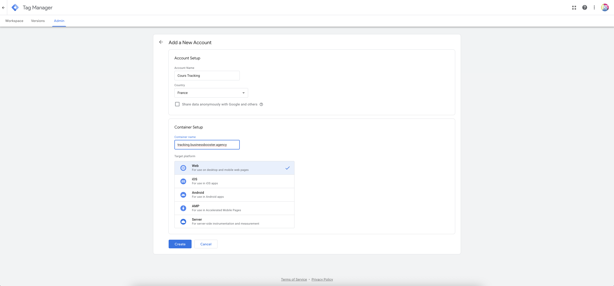
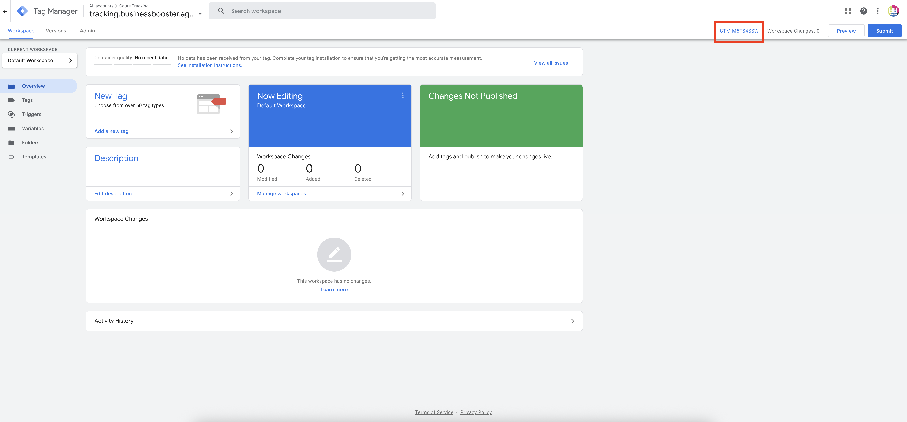
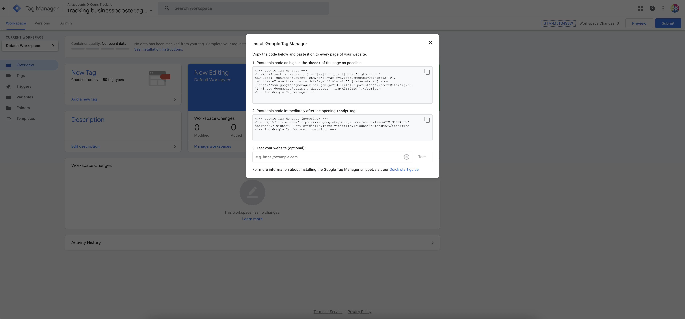
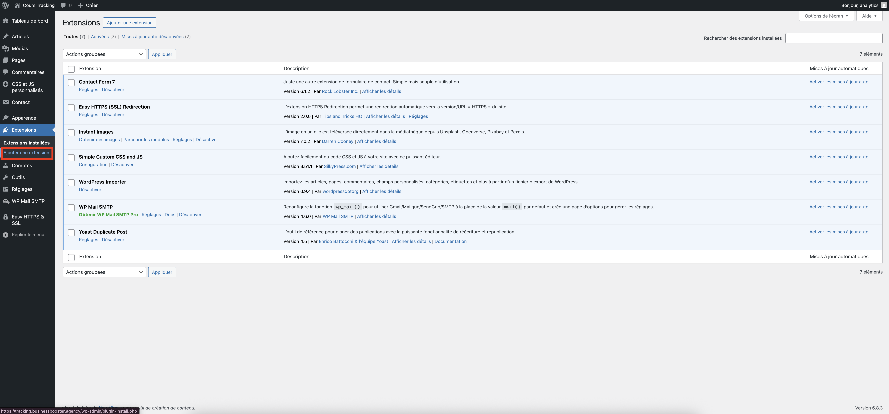
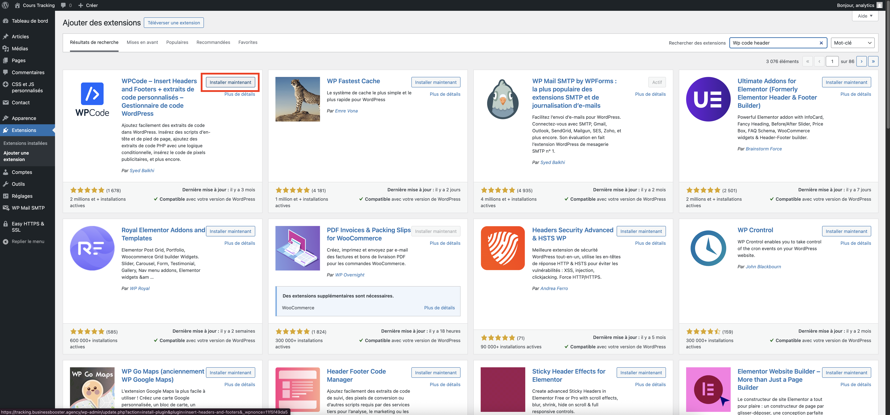
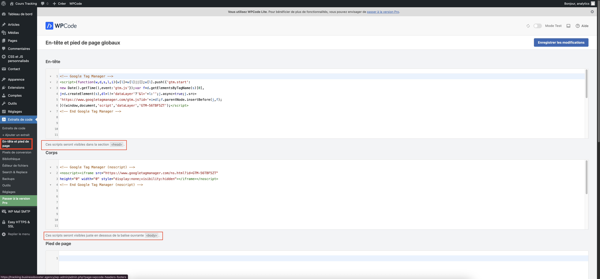
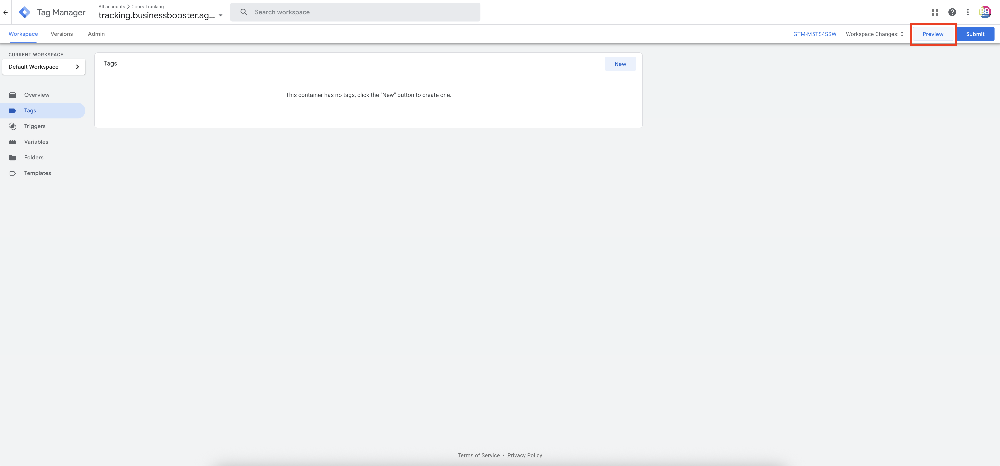
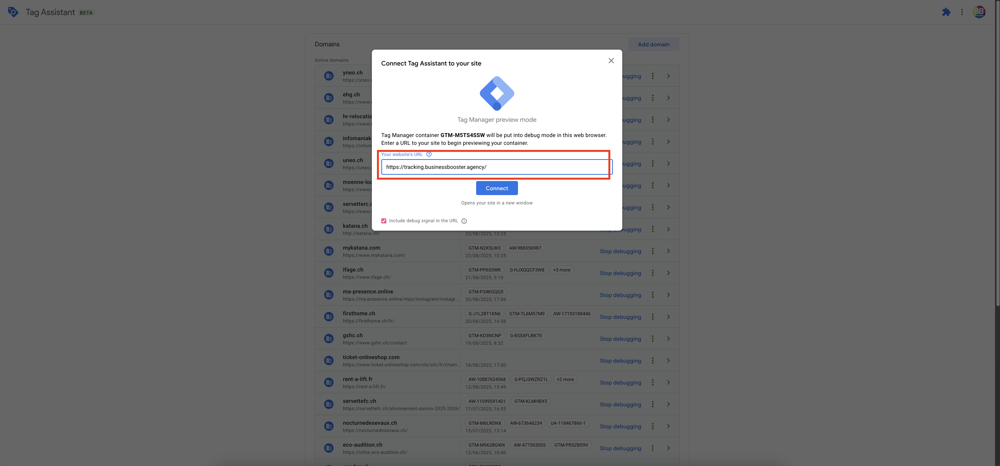
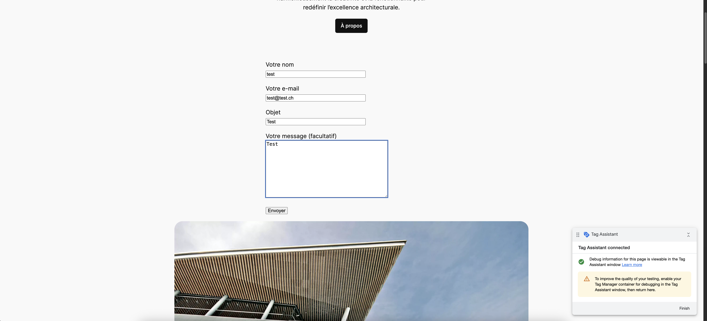

# Création du compte Google Tag Manager

Pour créer un compte GTM, rien de plus simple, connectez-vous sur [Google Tag Manager (GTM)](https://tagmanager.google.com/) avec votre compte google et sélectionner **créer un compte**, entrer le **nom du compte** puis commencez par sélectionner un **conteneur web**. 



## Intégration du GTM sur notre site web

Une fois le conteneur web créé, il faut l'intégrer sur le site web. Pour cela, il faut **cliquer sur l'ID GTM**. 


_Intégration du conteneur_ GTM

GTM vous donnera ces deux différents codes d'intégration à implémenter :


_Intégration du conteneur_GTM

### Codes d'intégration GTM

GTM vous donnera ces deux différents codes d'intégration à implémenter :

Un premier code de script à intégrer dans la balise ```<head>``` (e.g) , à ajouter après l'ouverture de la balise 
```html
<!-- Google Tag Manager -->
<script>(function(w,d,s,l,i){w[l]=w[l]||[];w[l].push({'gtm.start':
new Date().getTime(),event:'gtm.js'});var f=d.getElementsByTagName(s)[0],
j=d.createElement(s),dl=l!='dataLayer'?'&l='+l:'';j.async=true;j.src=
'https://www.googletagmanager.com/gtm.js?id='+i+dl;f.parentNode.insertBefore(j,f);
})(window,document,'script','dataLayer','GTM-M5TS4SSW');</script>
<!-- End Google Tag Manager -->
```

Un deuxième code à intégrer dans le ```<body>``` (e.g)
```html
<!-- Google Tag Manager (noscript) -->
<noscript><iframe src="https://www.googletagmanager.com/ns.html?id=GTM-M5TS4SSW"
height="0" width="0" style="display:none;visibility:hidden"></iframe></noscript>
<!-- End Google Tag Manager (noscript) -->
```

### Installation du plugin WordPress

Connectez-vous au tableau de bord Wordpress du site web, et rendez-vous dans la section **"Extensions"** et cliquer sur **ajouter une extension**  



Ensuite, vous devez télécharger l'extension (plugin) **WP Code, header footer** qui permet d'ajouter du code sans s'aventurer directement dans le code source du site web. 



**Activer** l'extension 

:::tip Vous allez directement dans la section **en-tête et pied de page** pour ajouter le code facilement. 



**Enregistrer les modifications** et ce code va s'ajouter sur toutes les pages dans la section ```<head>``` et dans la section ```<body>```. 

:::tip

Vous pouvez utiliser l'extension [**Tag Assistant**](https://chromewebstore.google.com/detail/tag-assistant/kejbdjndbnbjgmefkgdddjlbokphdefk/) pour vérifier que l'intégration est bien active

:::

### Test de l'implémentation

Afin de tester l'implémentation, vous retournez dans GTM et cliquer sur **prévisualiser** 



Le Tag Assistant se lance et vous devez ajouter l'url de votre site web



Une nouvel onglet s'ouvre ou une nouvelle fenêtre si vous avez pas installer l'extension Tag Assistant. Une petite fenêtre du Tag Assistant se lance en bas à droite de l'écran. 




:::tip

Si vous lisez "Tag Assistant connecté", c'est que l'implémentation du code a bien fonctionné. Vous êtes prêt pour ajouter des balises de tracking dans votre conteneur GTM.

:::