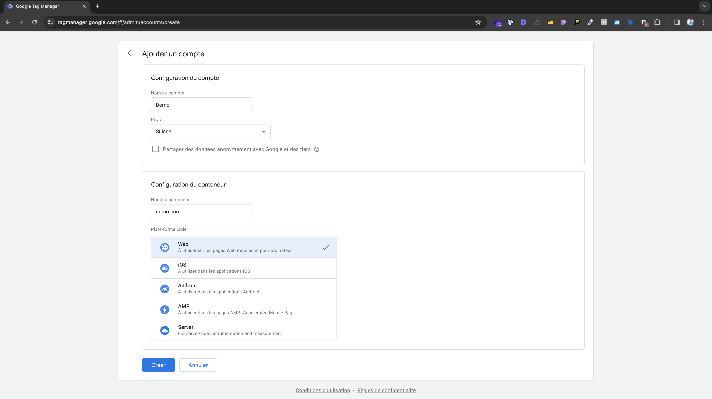
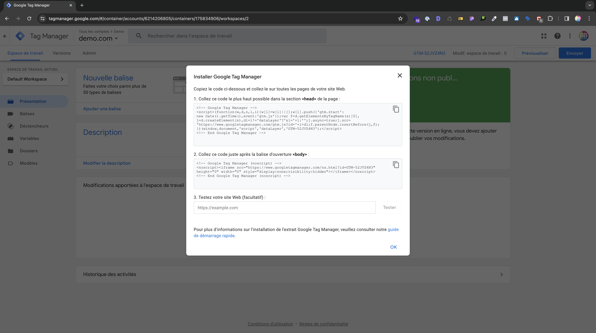

# Création du compte Google Tag Manager

Pour créer un compte [Google Tag Manager (GTM)](https://tagmanager.google.com/), rien de plus simple, connectez-vous avec votre compte google et sélectionner **créer un compte**, entrer le **nom du compte** puis commencez par créer un **conteneur web**


_Création d'un compte et conteneur web_

## Intégration du GTM

Une fois le conteneur web créé, il faut l'intégrer sur le site web.


_Intégration du conteneur_

GTM vous donnera ces deux différents codes d'intégration à implémenter :

Un premier code à intégrer dans le ```<head>``` (e.g)
```html
<!-- Google Tag Manager -->
<script>
  (function (w, d, s, l, i) {
    w[l] = w[l] || [];
    w[l].push({ "gtm.start": new Date().getTime(), event: "gtm.js" });
    var f = d.getElementsByTagName(s)[0],
      j = d.createElement(s),
      dl = l != "dataLayer" ? "&l=" + l : "";
    j.async = true;
    j.src = "https://www.googletagmanager.com/gtm.js?id=" + i + dl;
    f.parentNode.insertBefore(j, f);
  })(window, document, "script", "dataLayer", "GTM-52JVZ4N3");
</script>
<!-- End Google Tag Manager -->
```

Un deuxième code à intégrer dans le ```<body>``` (e.g)
```html
<!-- Google Tag Manager (noscript) -->
<noscript><iframe src="https://www.googletagmanager.com/ns.html?id=GTM-52JVZ4N3"
height="0" width="0" style="display:none;visibility:hidden"></iframe></noscript>
<!-- End Google Tag Manager (noscript) -->
```

:::warning

Attention les ```"``` peuvent être transformés et l'intégration peut ne pas fonctionner.

:::

:::tip

Vous pouvez utiliser l'extension [**Tag Assisitant Companion**](https://chromewebstore.google.com/detail/tag-assistant-companion/) pour vérifier que l'intégration est bien active

:::