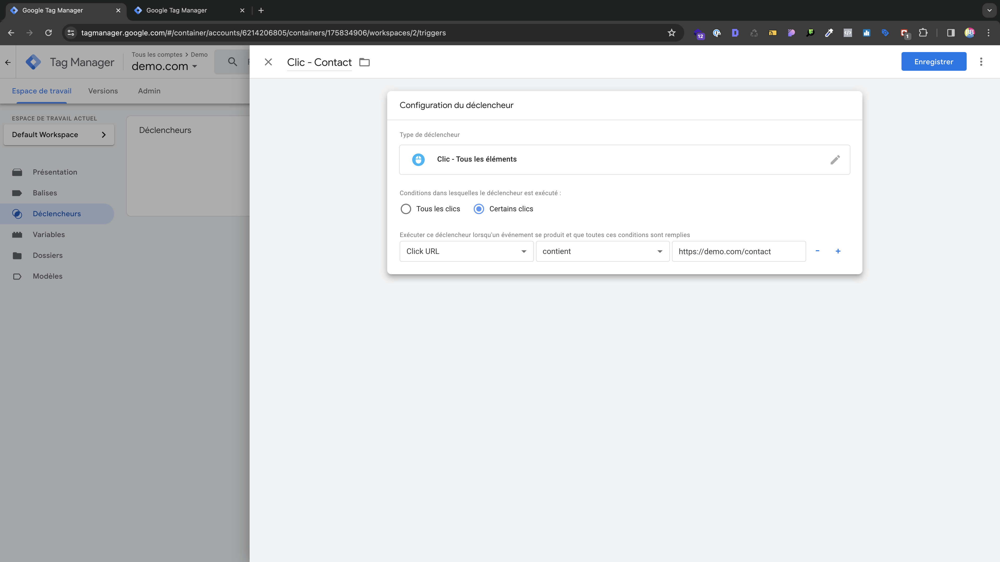

# Création de déclencheurs

Les événements personnalisés dans **Google Tag Manager** servent à suivre des actions spécifiques sur un site web, comme des clics sur des boutons ou des téléchargements. Ils permettent une collecte de données plus précise pour l'analyse et l'optimisation, offrant ainsi une flexibilité accrue par rapport aux balises de suivi standard.

Pour créer un évènement personnalisé il faut créer des **déclencheurs** qui vont permettre de détecter lorsqu'un utilisateur va effectuer une action sur le site web.

Nous allons donc créer le premier déclencheurs **Clic - Contact**

```
Clic - Contact
```

Dans l'onglet **_Déclencheurs_** séléctionnez **_Nouveau_** puis dans la partie **_Clic_** > **_Tous les éléments_** sélectionnez **_Certains clics_** puis dans la première case au lieu de **_Page Hostname_** sélectionnez **_Variable intégrée_** puis **_Clic URL_** et entrez le lien bouton contact


_Créer un déclencheur_

:::note
Vous pouvez tester votre déclencheur via l'extension [**Tag Assisitant Companion**](https://chromewebstore.google.com/detail/tag-assistant-companion/)
:::