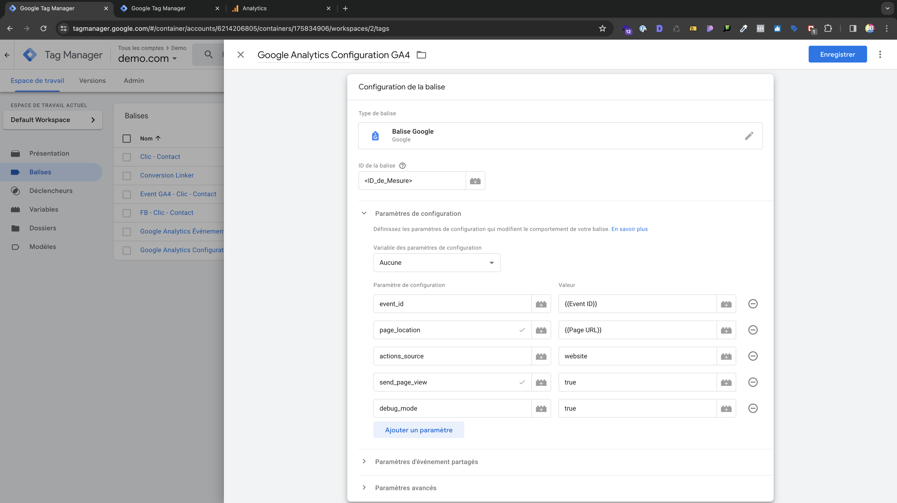

# Intégration de Google Analytics

Après avoir créer votre déclencheur et votre balise, il est temps d'intégrer Google Analytics.

## Créer la balise de Google Analytics Configuration GA4

Dans ***Balises*** > ***Nouvelle*** > ***Balise Google***.

Renseignez l'**ID de Mesure** de votre [Google Analytics](https://analytics.google.com/) qui se situe dans ***Administration*** > ***Flux de données***.

Ajouter les **Paramètres de configuration**

| **Paramètre d'événement** | **Valeur**       |
| ------------------------- | ---------------- |
| event_id                  | ``{{Event ID}}`` |
| page_location             | ``{{Page_URL}}`` |
| actions_source            | website          |
| send_page_view            | true             |
| debug_mode                | true             |



_Paramètres de configuration_


## Créer une balise Google Analytics : Événement GA4

Dans ***Balises*** > ***Nouvelle*** > ***Google Analytics*** > ***Google Analytics : Événement GA4***.

Renseignez l'**ID de Mesure** de votre [Google Analytics](https://analytics.google.com/) qui se situe dans ***Administration*** > ***Flux de données***.

## Nommer votre balise **Google Analytics : Événement GA4**

En général la balise d'évènement porte le même nom que que la balise de **Suivi des conversions Google Ads** mais avec ` Event GA4 ` devant (cf. [Création d'une Balise GTM](./create-tag.md)).

```
Event GA4 - Clic - Contact
```

## Ajouter le nom de l'évènement (e.g)

```
clic_contact
```

:::note

Les noms d'évènements s'écrivent en génral comme suit : **Nom_Evenement**.

:::

## Paramètres d'évènement

Dans la section **Paramètre d'événement** renseignez ces paramètres qui vont permettre par la suite de faire le lien avec le Pixel Meta.

| **Paramètre d'événement** | **Valeur**       |
| ------------------------- | ---------------- |
| event_id                  | ``{{Event ID}}`` |
| actions_source            | website          |


## Ajoutez le Déclencheur

Ajoutez le **Déclencheur** créé précédemment.