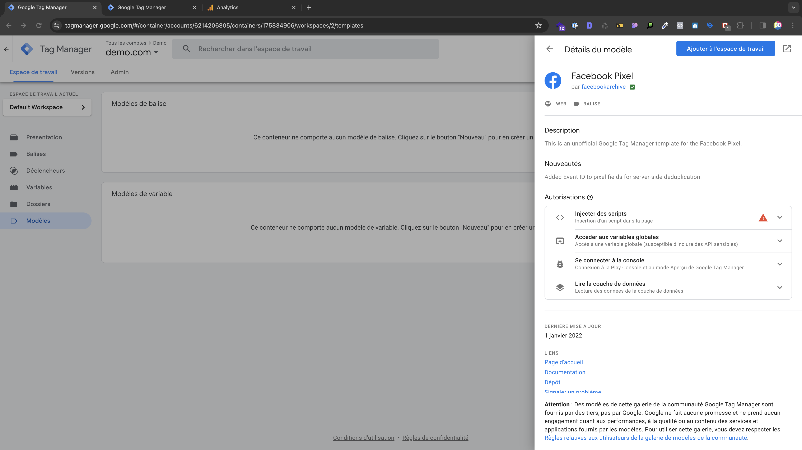
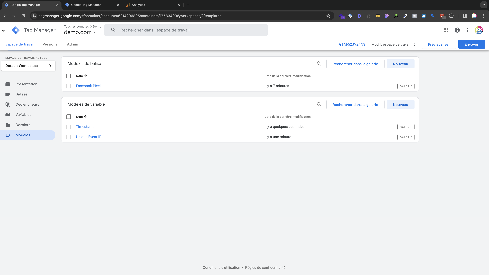

# Ajouter des modèles

Les modèles de variables et de balises dans Google Tag Manager (GTM) facilitent la réutilisation et la configuration cohérente des éléments, simplifiant ainsi le déploiement et la gestion des balises de suivi sur un site web.

## Modèles de balise

### Facebook Pixel

#### Facebook Pixel de facebookarchive

Le seul modèle que nous allons ajouter et le **Facebook Pixel** de **facebookarchive**.

#### Description du modèle

Le modèle de balise **Facebook Pixel** dans GTM simplifie le suivi du pixel Facebook sur un site. Pour les événements personnalisés, il facilite la configuration du suivi pour des actions spécifiques (clics, soumissions de formulaires, etc.), fournissant des données détaillées pour l'analyse des performances publicitaires sur Facebook.

#### Installation du modèle

Pour ajouter ce modèle de balise rendez-vous dans ***Modèles*** > ***Rechercher dans la galerie*** > puis tapez ***Facebook Pixel*** et sélectionnez celui de **facebookarchive** puis **Ajouter à l'espace de travail**

_Modèle de balise Facebook Pixel_

## Modèle de variable

Les modèles de variables dans Google Tag Manager simplifient la configuration des variables utilisées dans les balises, assurant une gestion cohérente et réduisant les erreurs. Ils offrent une flexibilité pour créer des configurations prédéfinies adaptées aux besoins spécifiques du suivi sur un site web.

### Unique Event ID

#### Description du modèle

Le modèle de balise **Unique Event ID** de **stape-io** permet d'assigner un identifiant unique à chaque événement suivi sur un site web. Cela offre une granularité plus fine dans l'analyse des données d'événements.

#### Installation du modèle

Pour ajouter ce modèle de balise rendez-vous dans ***Modèles*** > ***Rechercher dans la galerie*** > puis tapez ***Unique Event ID*** et sélectionnez celui de **stape-io** puis **Ajouter à l'espace de travail**

### Timestamp

#### Installation du modèle

Pour ajouter ce modèle de balise rendez-vous dans ***Modèles*** > ***Rechercher dans la galerie*** > puis tapez ***Timestamp*** et sélectionnez celui de **luratic** puis **Ajouter à l'espace de travail**

## Vérification des modèles

Vous devriez avoir au final 3 modèles ajoutés à votre espace de travail

_Modèles de balise et variables_