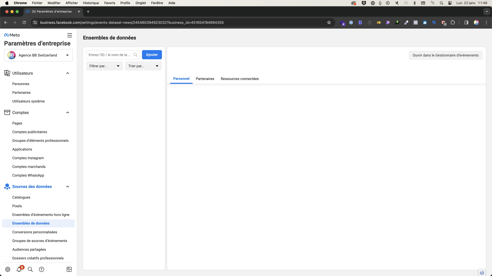

# Création du Pixel Meta

Création du Pixel Meta depuis les  **Paramètres d'entreprise**

## Créer un Pixel

Pour créer un pixel il faut se rendre dans les **Paramètres d'entreprise** > **Sources de données** > [**Ensemble de données**](https://business.facebook.com/settings/events-dataset-news/) > **Ajouter**

