# Intégration des balises de conversions Meta

Si vous effectuez une campagne sur Meta, et que vous avez ajouté votre pixel Meta, vous pouvez créer des **balises spécifiquement pour Meta**. 

## Création d'une balise pour Meta

### Ajout du modèle Facebook Pixel

Pour se faire, il faut aller dans l'onglet **Modèles**  de GTM votre site web

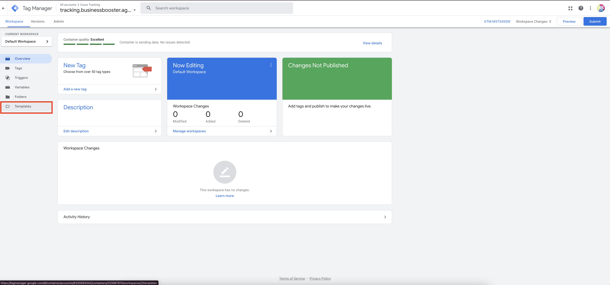

:::warning

**Chercher dans la Galerie** pour trouver le modèle de balise **Facebook Pixel par facebook-archive** et ajouter-le à l'espace de travail. 

:::

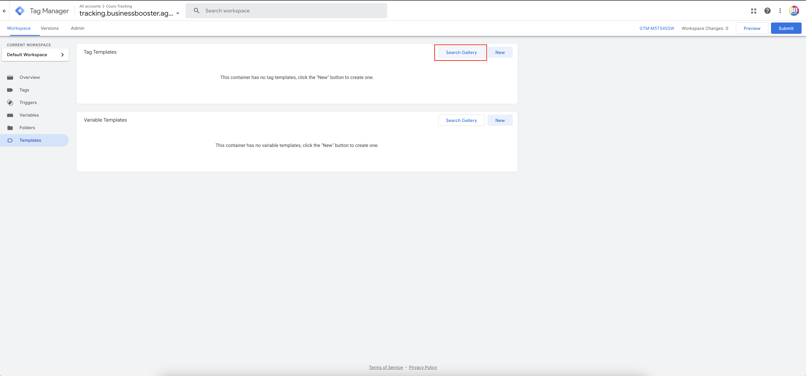
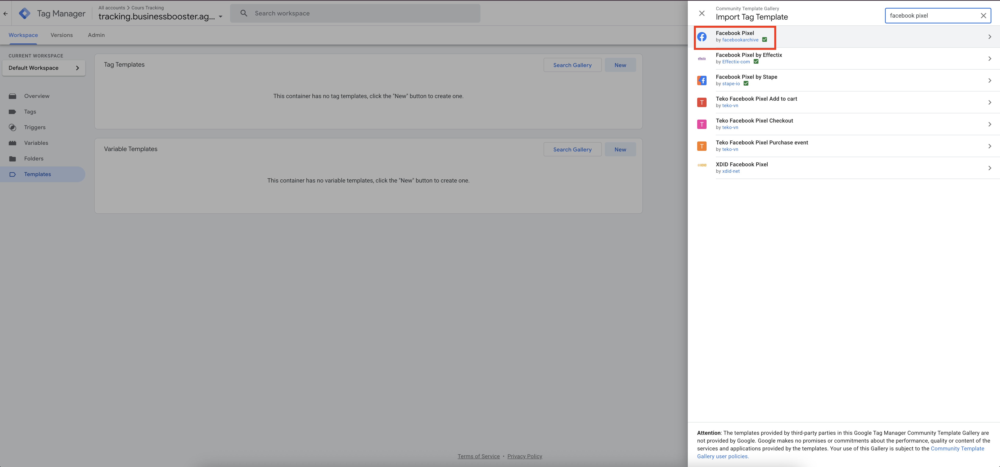

### Création de la balise

Ensuite créer une nouvelle balise Facebook en cliquant dans l'onglet **Balises**, puis sur **Nouveau** pour trouver le type de balise Facebook archive que l'on vient d'ajouter au conteneur.

## Configuration d'une balise pour Meta - Évènement standard

Ici, nous vous donnons un exemple de balises pour un envoi de formulaire. 

:::warning

Vous pouvez utiliser les  [évènements standards Meta](https://www.facebook.com/business/help/402791146561655?id=1205376682832142) dans la balise si votre évènement correspond à l'un des évenements standards ( e.g : achat, ajout au panier, inscription, envoi de formulaire, contact, etc.)

:::

### Configuration de la balise

Dans la balise, vous devez ajouter l'ID du Pixel composé de 15 chiffres. Il se trouve dans le **Gestionnaire d'èvenements** ou lorsque que vous créez une campagne dans **Meta**

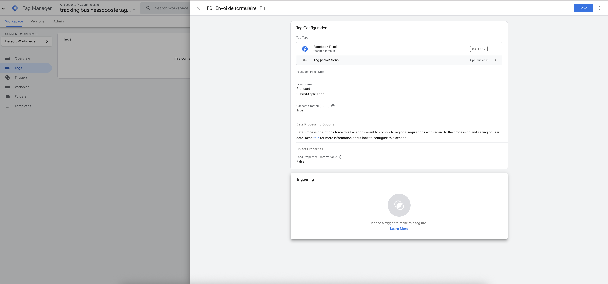

### Configuration du déclencheur

Il faut configurer ensuite un **déclencheur** en cliquant sur la zone en dessous de la configuration ci-dessus. 

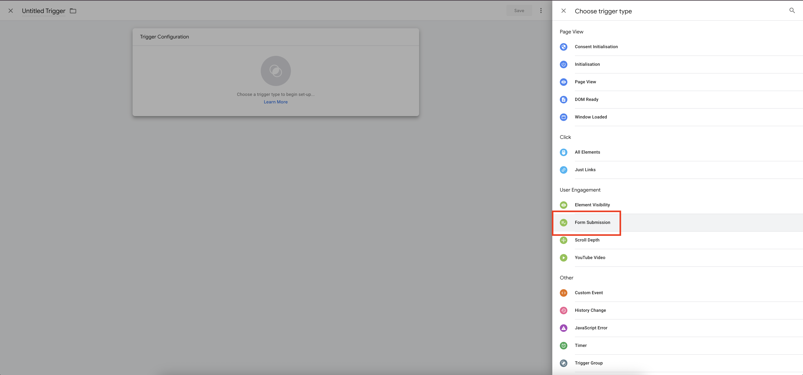

### Test de la balise

Une fois la balise prête, il faut retourner dans **prévisualiser** pour cette fois-ci tester si la balise fonctionne et déclenche lors d'un envoi de formulaire dans ce cas précis. 

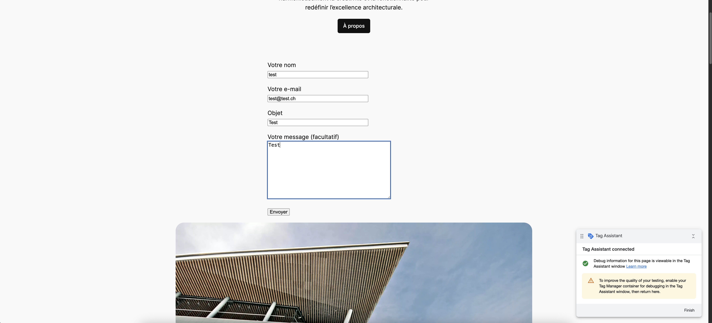

Vous pouvez vérifier dans la fenêtre du Tag Assistant si votre balise s'est bien déclenchée. La balise passe en dessous du titre **Balises déclenchée**

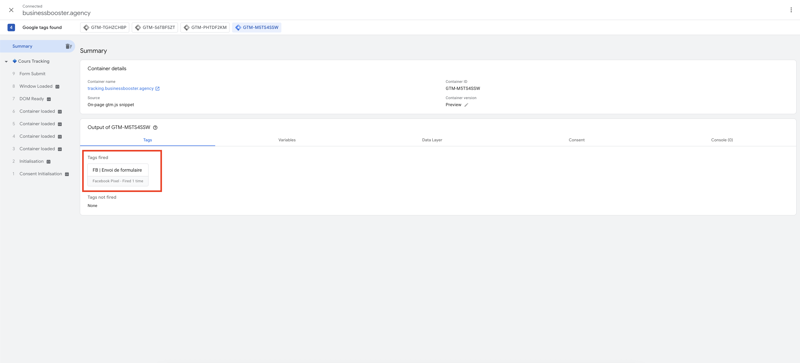

:::warning

Si vous avez terminé vos balises et qu'elle se déclenche bien quand vous le souhaitez, vous ne devez pas oublier de **publier** le conteneur sans quoi votre tracking ne sera pas ajouté à Meta avant cette publication
:::

## Création d'une balise pour Meta - Évènement personnalisé

:::tip

Dans le cas où l'évènement que vous souhaitez tracker n'est pas un évènement standard, vous pouvez utiliser les évènements personnalisé. Dans la configuration de la balise, il faut sélectionner **custom**

:::

### Configuration de l'événement personnalisé

Voici un exemple de balise pour un clic sur un numéro de téléphone :

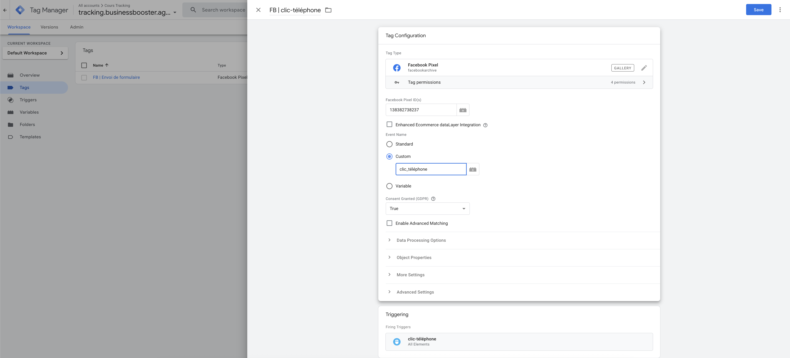

### Validation dans le Gestionnaire d'événements

:::warning

Si vous utilisez un **évènement personnalisé**, il doit ensuite être examiné dans les paramètres de **Gestionnaires d'évènements** et ajouter comme **conversion personnalisée**. Sinon vos conversions personnalisés ne sont pas comptabilisés et utilisés par les campagnes Meta.

:::

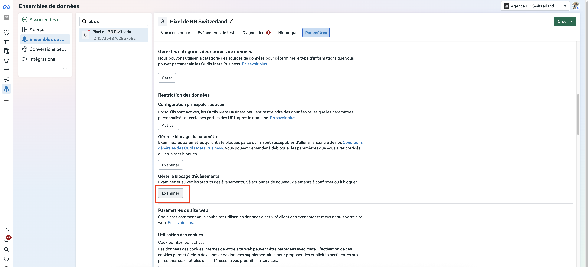

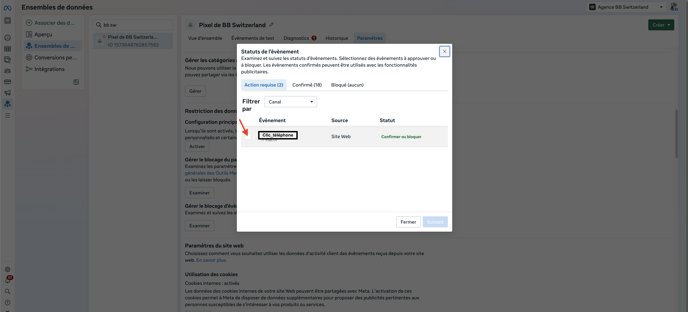

Vous arrivez sur cette fenêtre où vous devez confirmer les nouveaux évènements que vous avez créés. 

### Création de la conversion personnalisée

Ensuite, vous devez vous rendre dans l'onglet **Conversions personnalisées** et cliquer sur **Créer une conversion personnalisée**. Vous pouvez la sélectionner dans la liste des évènements. 

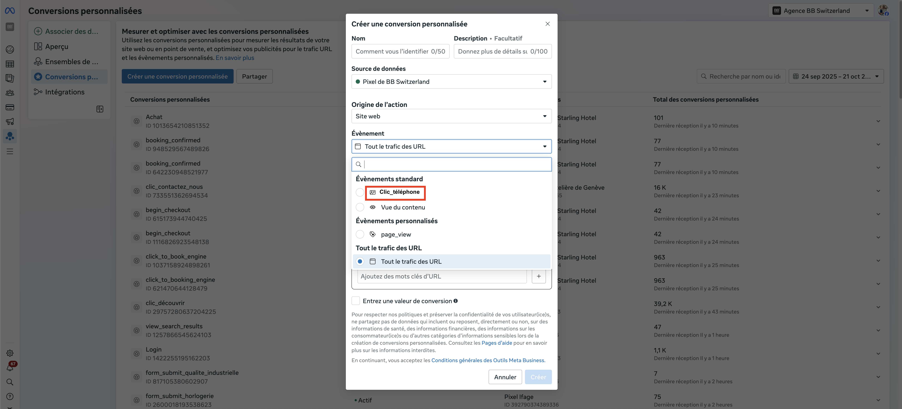

:::warning

Il faut souvent attendre plusieurs heures avant de voir l'évènement disponible dans les **conversions personnalisées**. 
:::

## Vérification des événements

### Vue d'ensemble du Gestionnaire d'événements

Que ce soit un évènement standard ou personnalisé, vous devez voir vos évènements apparaître dans la **Vue d'ensemble** du Gestionnaire d'évènements

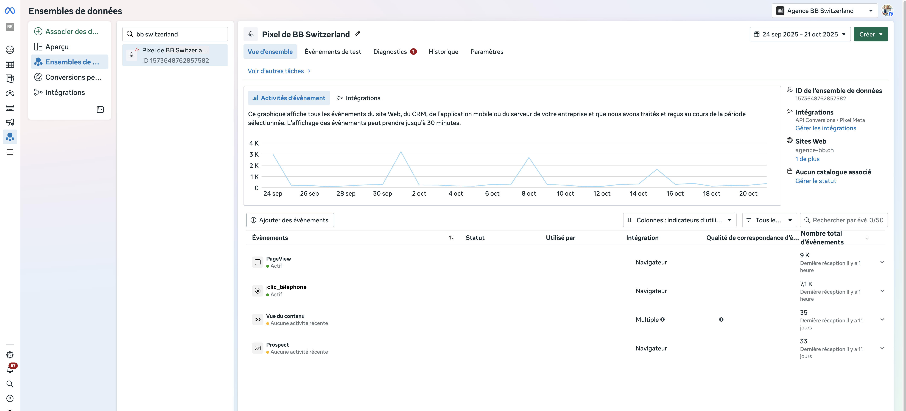

### Test direct dans Meta

Si vos conversions des balises que vous venez de créer ne remontent toujours pas, vous pouvez les tester directement dans Meta. Si elles se déclenchent ici, il faut compter 30 minutes minimum avant qu'elle soit visible dans la Vue d'Ensemble. 

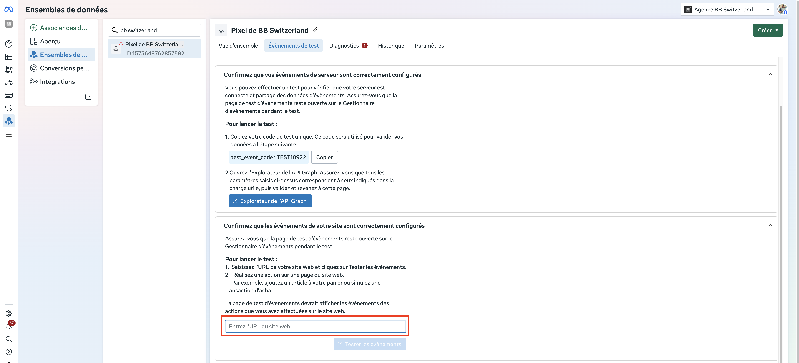