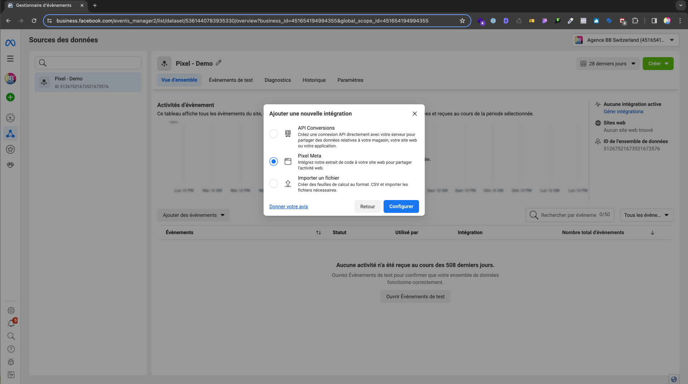

# Intégration site web

## Configuration du Pixel Meta

Création du Pixel Meta depuis le **Gestionnaire d'Évènements**

### Intégration du code

Une fois le pixel créé, il est temps de l'intégrer au site web.

Pour se faire, il faut aller dans le **Gestionnaire d'Évènements** et cliquez sur **Gérer intégrations** > **Ajouter une nouvelle intégration** > **Pixel Meta** > **Ajouter un code manuellement à votre site web**



### Installation du code

Copiez puis activer la correspondance avancée et ensuite collez le code dans le ```<head>``` de votre site web

:::info

Si vous n'avez pas pu activer la **correspondance avancée automatique sur le site web content** vous pouvez l'activer dans les **Paramètres** du pixel.

:::

### Exemple de code

Le code devrait ressembler à ceci

```html
<!-- Meta Pixel Code -->
<script>
  !(function (f, b, e, v, n, t, s) {
    if (f.fbq) return;
    n = f.fbq = function () {
      n.callMethod ? n.callMethod.apply(n, arguments) : n.queue.push(arguments);
    };
    if (!f._fbq) f._fbq = n;
    n.push = n;
    n.loaded = !0;
    n.version = "2.0";
    n.queue = [];
    t = b.createElement(e);
    t.async = !0;
    t.src = v;
    s = b.getElementsByTagName(e)[0];
    s.parentNode.insertBefore(t, s);
  })(
    window,
    document,
    "script",
    "https://connect.facebook.net/en_US/fbevents.js"
  );
  fbq("init", "<ID_de_l’ensemble_de_données>");
  fbq("track", "PageView");
</script>
<noscript
  >&ev=PageView&noscript=1"
/></noscript>
<!-- End Meta Pixel Code -->
```

## Vérification de l'installation

:::tip

Pour vérifier si le **pixel** est bien installé, vous pouvez utiliser l'extension [Meta Pixel Helper](https://chromewebstore.google.com/detail/meta-pixel-helper/).

:::
