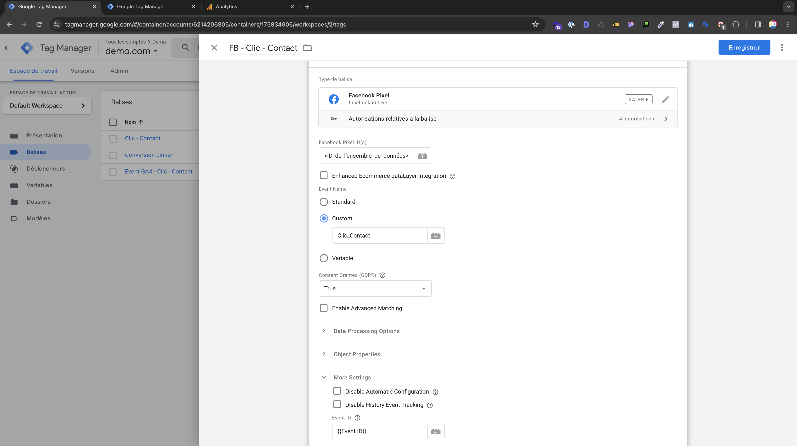
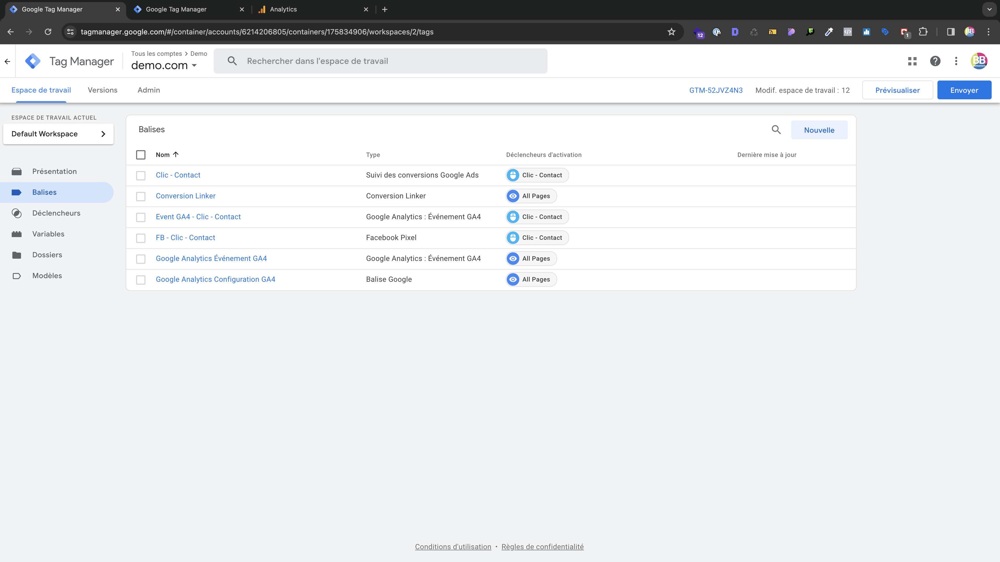

# Création d'un Évènement personnalisé Meta

Après avoir intégré vos Balise de **Suivi des conversions Google Ads** et **Google Analytics : Événement GA4**. Il est temps de créer une balise de type **Facebook Pixel** pour que les évènements personnalisés Google soient traqués également sur Facebook/Meta.

## Balise Facebook Pixel

### Configuration de la balise

Dans ***Balise*** sélectionnez ***Nouvelle*** puis dans la section ***Personnalisés*** sélectionnez ***Facebook Pixel***.

Et renseignez ces valeurs.

### Nom de l'événement

:::warning

Le nom de l'Évènement doit être identique à celui des **Google Analytics : Événement GA4**

```
clic_contact
```

:::


_Facebook Pixel & GTM_

### Nommage de la balise

:::info
Les Balise Facebook portent le même nom que que la balise de **Suivi des conversions Google Ads** mais avec ` FB ` devant.
```
FB - Clic - Contact
```
:::

## Résumé des balises

### Vue d'ensemble des balises

Vous devriez donc avoir l'ensemble de ces balises dans votre conteneur web



## Test des balises

### Méthodes de test

:::info
Vous pouvez maintenant tester vos balises et évènements dans la **Prévisualisation de GTM** mais aussi dans l'onglet **Évènement de test** de votre pixel.
:::