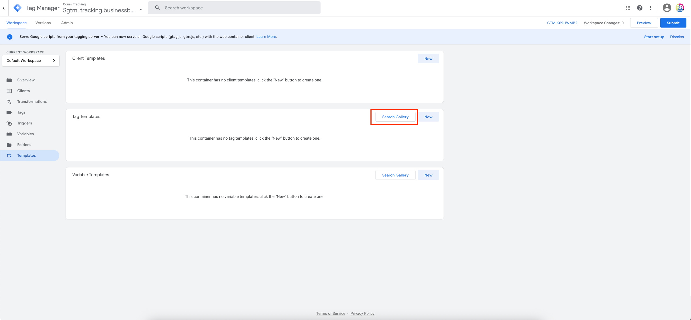
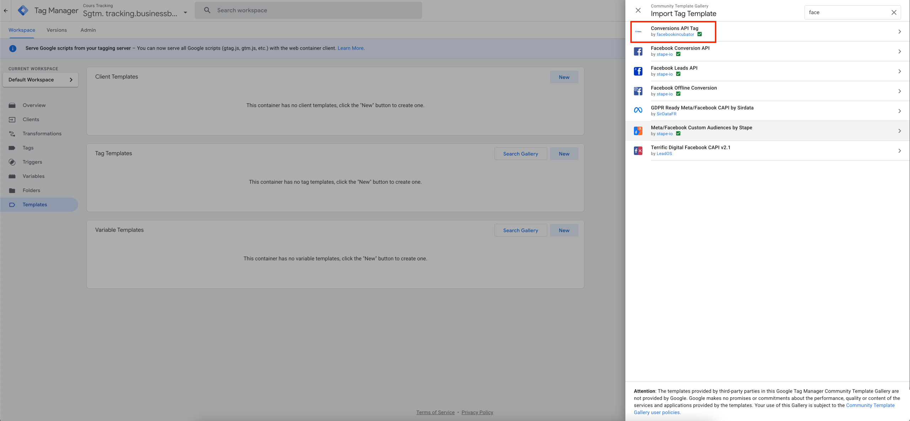
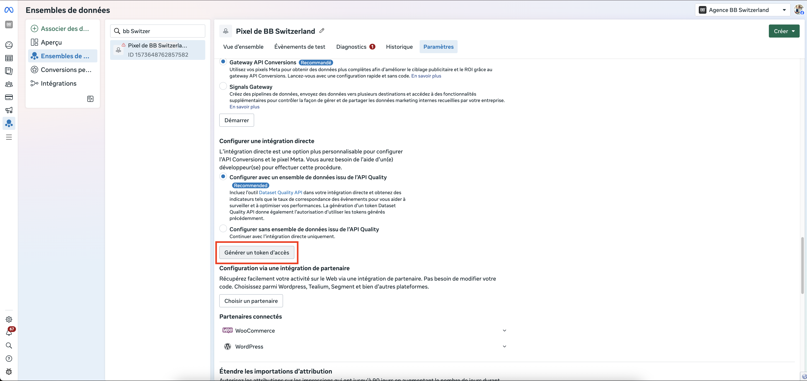
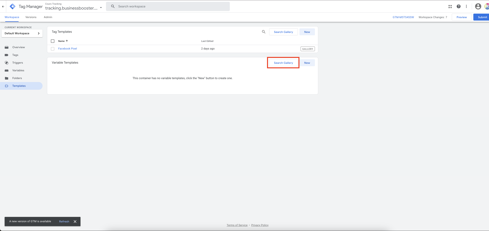
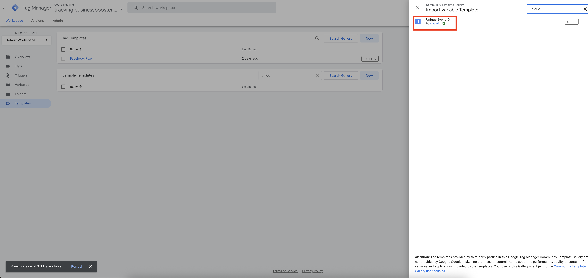
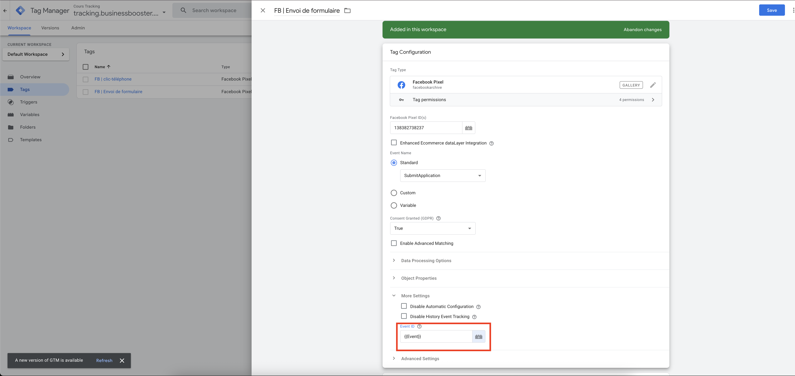

# Installation de l'API de Conversions META

Une fois que les DNS seront configurés, vous pourrez intégrer l'API de Conversions sur votre conteneur serveur.

## Ajout du modèle de balise

- ***Modèles*** > ***Modèles de balises***
- ***Rechercher dans la galerie***
- ***Conversions API Tag***
- Sélectionnez **Conversions API Tag** par **facebookincubator**

## Configuration des déclencheurs

Créez ce déclencheur qui va permettre par la suite de déclencher GA4 côté serveur GA4 à chaque chargement de page.

_Déclencheur GA4_

:::note
Si vous ne voyez pas **Client Name** dans les variables, vous devez le récupérer dans les **variables intégrées**
:::

## Configuration du client GA4

Ajouter ensuite le client GA4 comme suit.

_Client GA4_

## Ajouter la balise de l'API de Conversions META

### Configuration de la balise

Vous pouvez ensuite ajouter la balise **Facebook Conversions API Tag** en renseignant l'**ID de l'ensemble de données** le **token** dans les paramètres du pixel et le **Test Event Code** dans l'onglet Évènement de test du Pixel.

### Recherche dans la galerie

Vous devez vous rendre dans la section **modèle** et chercher dans la galerie des balises.

### Configuration des paramètres Meta

Ensuite, vous devez configurer la balise Meta pour le conteneur serveur. Il ajouter le **Pixel ID**, le **Token d'accès** qui se trouve dans les paramètres du **Gestionnaire d'évènement**. 

### Finalisation de la configuration

Vous pouvez ajouter ces infos dans la balise de configuration **Conversion Api Tag** dans l'onglet **balises**. Et puis vous devez ajouter en **déclencheur le client GA4**. 

:::tip 

Votre configuration pour l'API de conversions Meta dans le conteneur serveur est prête. Vous n'oubliez pas **publier** le conteneur. Puis, ill vous reste à configurer les balises dans le conteneur web

:::
## 

# Configuration des balises dans le conteneur web pour utiliser  l'API de Conversions META 

## Ajout de la variable unique event id

Lorsque vous avez créé vos balises Meta dans le conteneur web. Pour que cet évènement devienne un évènement serveur (et non pas via le navigateur), vous devez ajouter une variable qui s'appelle **unique event id** sur votre balise Meta. 

:::info
Vous devez rajouter dans **Paramètres supplémentaires** la variable **unique event id** pour que les évènements Meta soient envoyés côté serveur via les évènements **GA4**.
:::

## Configuration de l'URL du conteneur serveur

Enfin il ne vous reste plus qu'à changer l'URL du conteneur serveur dans deux endroits.

- ***Admin*** > ***Parmètres du conteneur***
- ***Conteneur web*** > ***Balise*** > ***Google Analytics Configuration GA4***

_URL conteneur serveur configuration GA4_

## Test et validation

:::note

Il ne vous reste plus qu'à tester vos évènements et de voir si la déduplication fonctionne correctement.

:::

