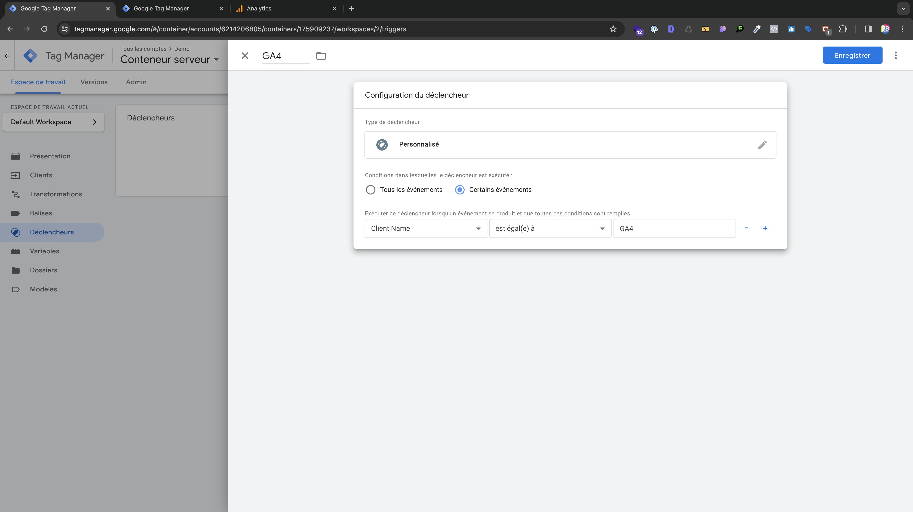
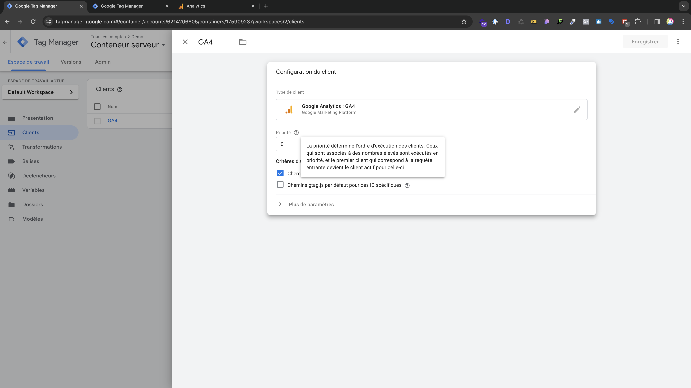
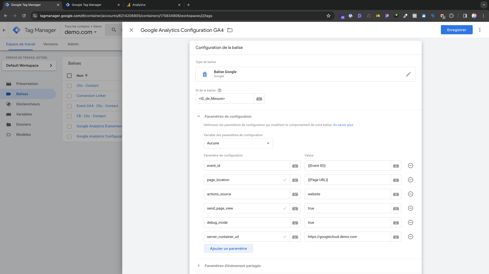

# Installation de l'API de Conversions sur le conteneur serveur

Une fois que les DNS seront configurés, vous pourrez intégrer l'API de Conversions sur votre conteneur serveur.

## Modèle de balise Conversions API Tag

- ***Modèles*** > ***Modèles de balises***
- ***Rechercher dans la galerie***
- ***Conversions API Tag***
- Sélectionnez **Conversions API Tag** par **facebookincubator**

## Déclencheurs 

Créez ce déclencheur qui va permettre par la suite de déclencher GA4 côté serveur GA4 à chaque chargement de page.

_Déclencheur GA4_

:::note
Si vous ne voyez pas **Client Name** dans les variables, vous devez le récupérer dans les **variables intégrées**
:::

## Client GA4

Ajouter ensuite le client GA4 comme suit.

_Client GA4_

## Ajouter la balise de l'API de Conversions

Vous pouvez ensuite ajouter la balise **Facebook Conversions API Tag** en renseignant l'**ID de l'ensemble de données** le **token** dans les paramètres du pixel et le **Test Event Code** dans l'onglet Évènement de test du Pixel.

## Changement URL du conteneur serveur

Enfin il ne vous reste plus qu'à changer l'URL du conteneur serveur dans deux endroits.

- ***Admin*** > ***Parmètres du conteneur***
- ***Conteneur web*** > ***Balise*** > ***Google Analytics Configuration GA4***

_URL conteneur serveur configuration GA4_

:::note
Il ne vous reste plus qu'à tester vos évènements et de voir si la déduplication fonctionne correctement.
:::