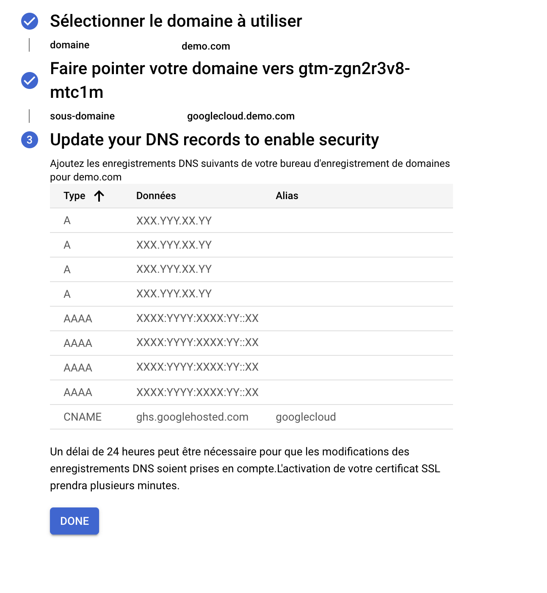

# Configuration du conteneur sur Google Cloud Platform

Une fois sur Google Cloud Platform rendez-vous sur ***Cloud Run** > ***Déployer des services*** > ***Services***

Dès que les services sont déployés, rendez-vous sur ***Gérer les Domaines personnalisés*** et cliquez sur ***Ajouter un mappage*** en le reliant au service déployé.

Ajouter votre domaine **mydomain.com** et faite le validé si nécessaire dans la search console.

Après avoir fait validé, faites pointer votre **sous-domaine** et enregistrer les mappages.

```
measure.mydomain.com
```

:::danger
Il faut absolument mettre un sous-domaine et non votre domaine sinon votre plantera.
:::

Renseignez ensuite les **enregistrements DNS dans votre hébergeur** sauf le **CNAME** sous votre sous-domaine **googlecloud.demo.com**


_Enregistrement DNS_

:::danger

Renseignez bien uniquement les "A" et "AAAA" dans votre hébergeur les enregistrement DNS sous le sous-domaine et non votre domaine sinon votre site plantera.

:::