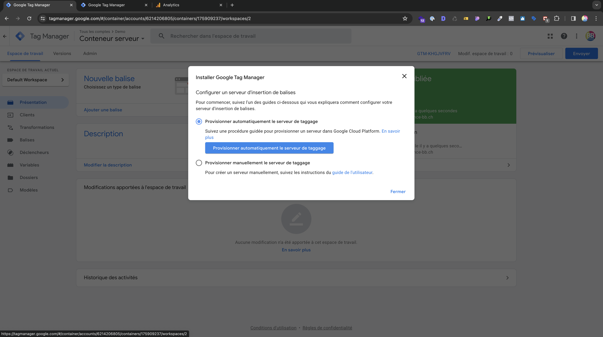
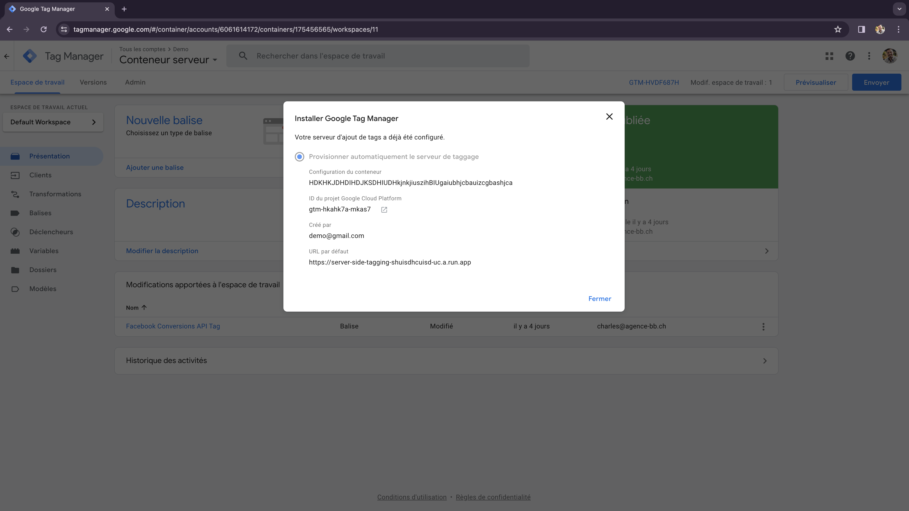

# Création du conteneur serveur

L'API de Conversions de Meta est un outil positionné côté serveur et non côté navigateur. Il vous permet de suivre les conversions via le serveur de votre site web, plutôt que via le navigateur de votre client.

## Pourquoi  utiliser l'API de Conversions ?

Depuis les dernières versions d'iOS, le pixel ne parvient plus à suivre les activités sur mobile du côté du navigateur. Étant donné que le trafic mobile représente plus de 60% du trafic sur le web, l'API de conversions devient essentielle pour capturer cette activité. En effet, l'API de Conversions passe par le serveur pour effectuer ce suivi, contournant ainsi le blocage des dernières versions d'iOS du côté du navigateur.


Pour créer le conteneur serveur rendez-vous dans l'onglet ***Admin*** > ***+***.

Nommez le conteneur.

```
Conteneur serveur
```


_Création du conteneur serveur_

Sélectionnez ***Provisionnez automatiquement le serveur de taggage*** puis ***Créer un compte de facturation***


_Configuration conteneur seveur_

## Configuration du conteneur

Une fois sur le conteneur serveur créé rendez-vous sur le lien de **ID du projet Google Cloud Platform <svg width="13.5" height="13.5" aria-hidden="true" viewBox="0 0 24 24" class="iconExternalLink_node_modules-@docusaurus-theme-classic-lib-theme-Icon-ExternalLink-styles-module"><path fill="currentColor" d="M21 13v10h-21v-19h12v2h-10v15h17v-8h2zm3-12h-10.988l4.035 4-6.977 7.07 2.828 2.828 6.977-7.07 4.125 4.172v-11z"></path></svg>**


_Déploiement conteneur serveur_
