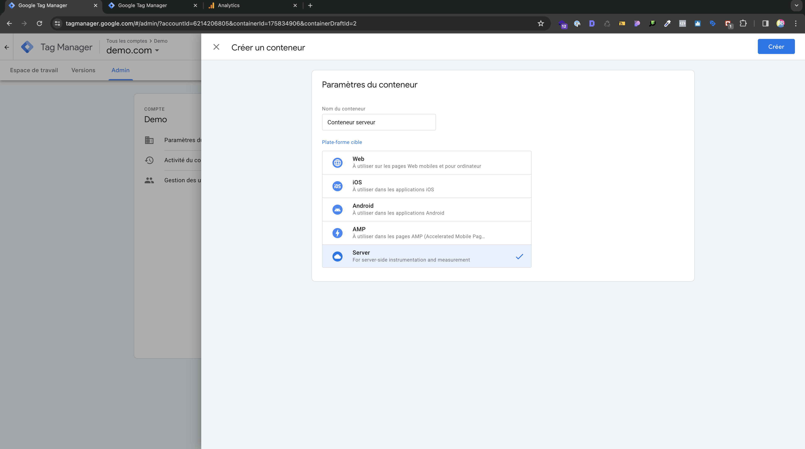
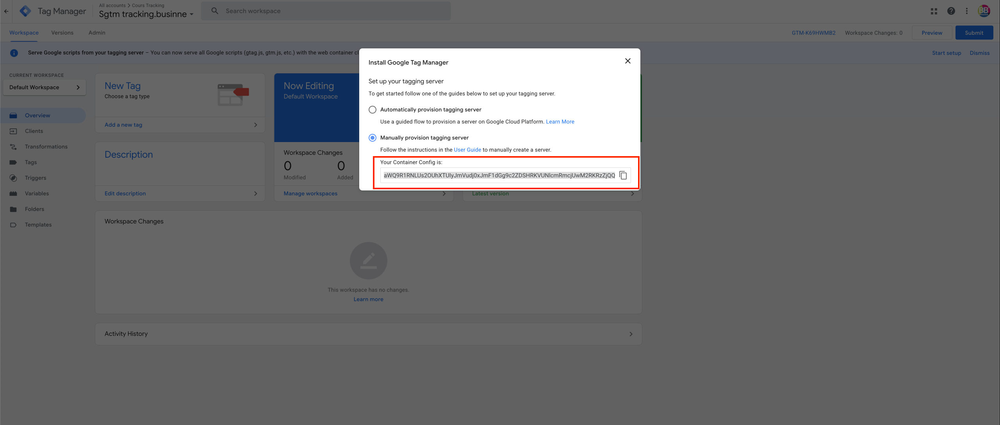

# Création du conteneur serveur

L'API de Conversions de Meta est un outil positionné côté serveur et non côté navigateur. Il vous permet de suivre les conversions via le serveur de votre site web, plutôt que via le navigateur de votre client.

## Pourquoi  utiliser l'API de Conversions ?

Depuis les dernières versions d'iOS, le pixel ne parvient plus à suivre les activités sur mobile du côté du navigateur. Étant donné que le trafic mobile représente plus de 60% du trafic sur le web, l'API de conversions devient essentielle pour capturer cette activité. En effet, l'API de Conversions passe par le serveur pour effectuer ce suivi, contournant ainsi le blocage des dernières versions d'iOS du côté du navigateur.


## Création du conteneur

Pour créer le conteneur serveur rendez-vous dans l'onglet ***Admin*** > ***+***.

### Nommage du conteneur

Nommez le conteneur.

```
Conteneur serveur
```


_Création du conteneur serveur_

### Configuration manuelle

Sélectionnez ***Manually provision tagging server*** puis ***Copier Your Container Config is***


_Configuration conteneur seveur_

## Déployer le conteneur serveur sur Stape
Nous recommandons d'utiliser Stape pour héberger votre conteneur serveur. Vous pouvez vous référer à l'onglet sur la [configuration du conteneur serveur avec Stape](./stape.md)
