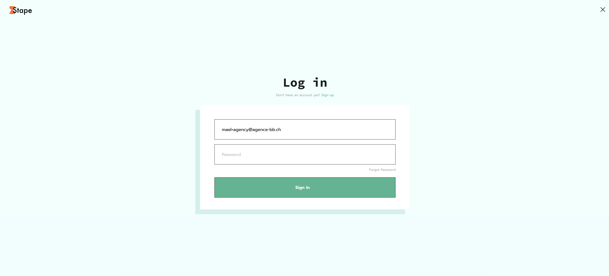
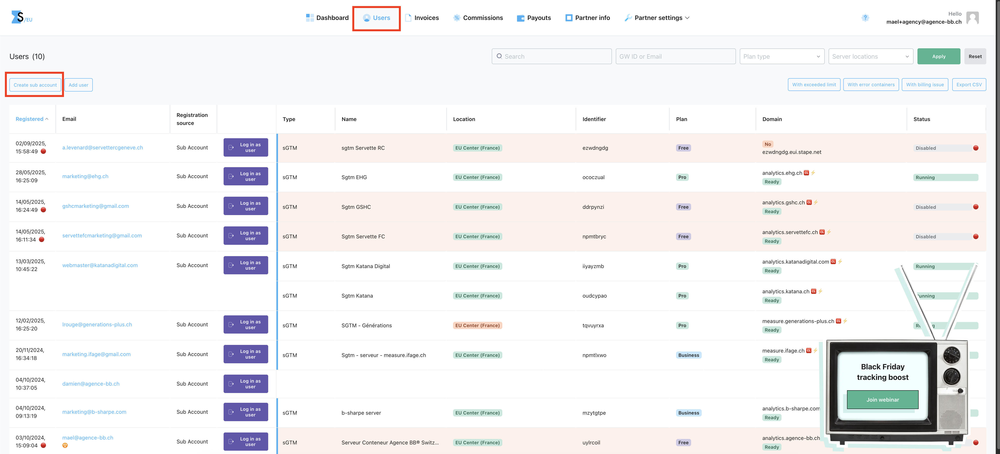
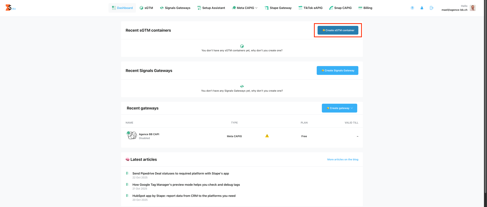
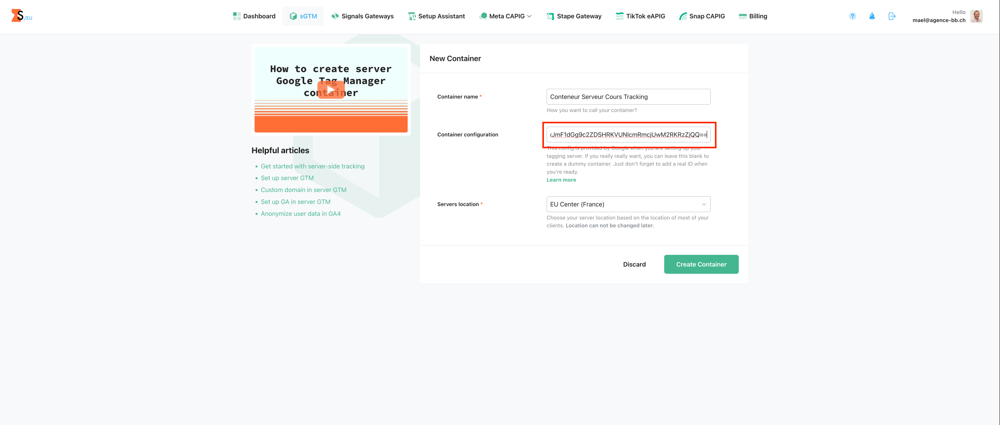
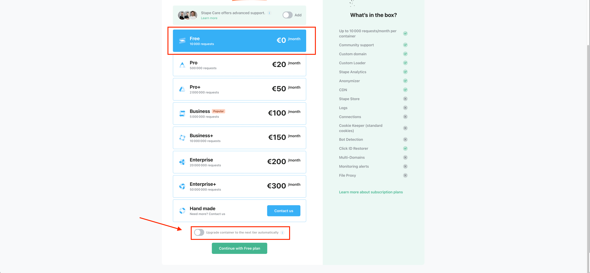
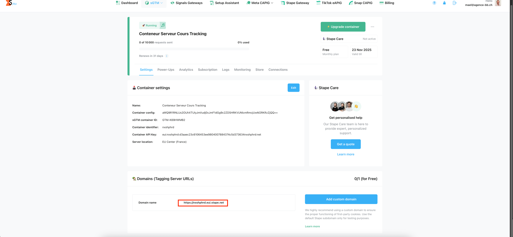
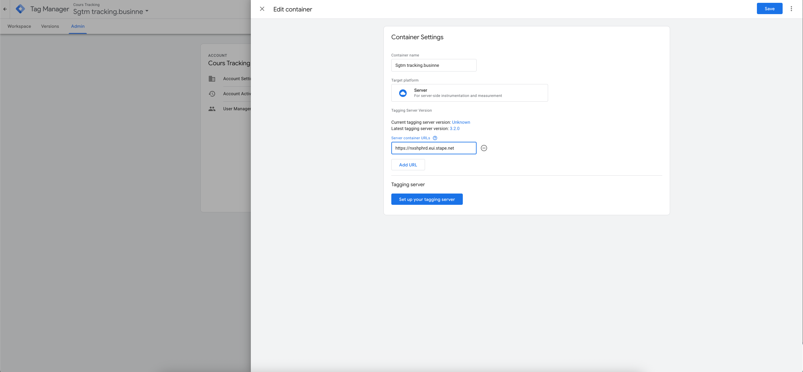
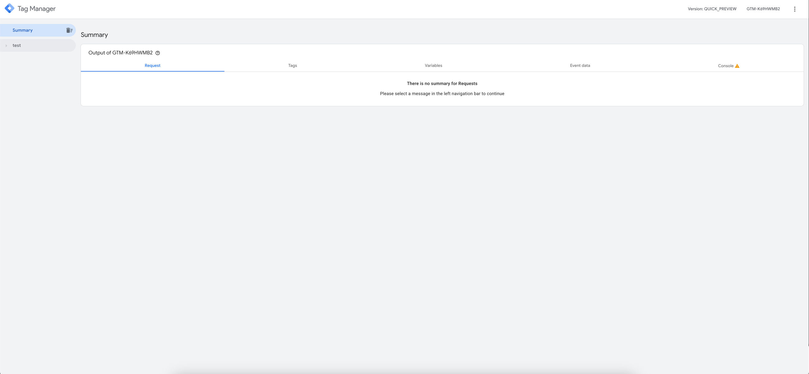
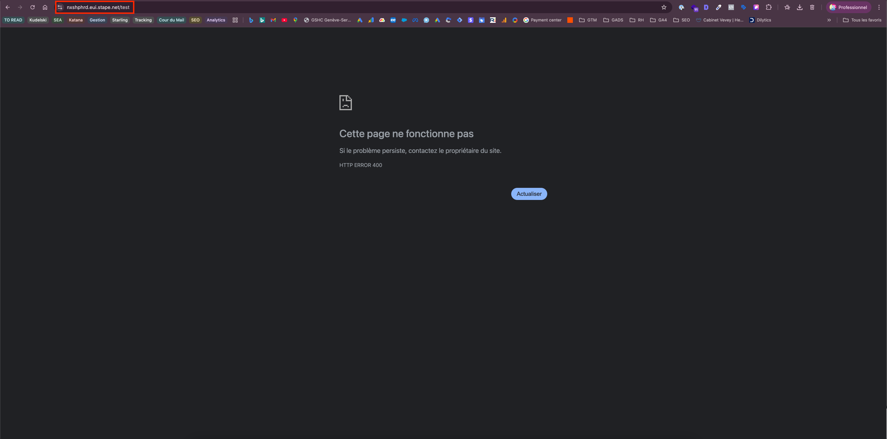

# Configuration du conteneur serveur avec Stape

## Connexion à Stape

Rendez-vous sur le **compte manager Stape**. 

### Informations de connexion

:::warning
Il existe le compte client avec mael@agence-bb.ch et le compte agence avec mael+agency@agence-bb.ch que vous devez utiliser pour créer un nouveau compte client
:::

Le mot de passe pour les deux comptes Stape sont les mêmes et se trouvent dans 1Password. 

## Ajouter un nouveau client chez Stape 

### Création du sous-compte

Ensuite, il se faut se rendre dans **Users** pour et cliquer **create sub account** pour ajouter un nouveau client.

### Ajout des informations client

Ici, vous **ajouter** les coordonnées de votre client afin de pouvoir l'ajouter de votre liste de compte clients. 

:::tip 

Avec Stape, vous pouvez accéder directement dans les comptes de votre client depuis le compte manager en cliquant sur **login as user**

:::

## Configuration du conteneur serveur

### Création du conteneur sGTM

Nous allons cliquer sur **create sGTM container** afin de configurer notre conteneur serveur. 

### Configuration du conteneur

Vous pouvez donner un nom à votre conteneur serveur et ensuite ajouter le code de configuration du conteneur. Ce dernier se trouve dans le conteneur serveur quand vous cliquez sur l'ID GTM ou bien dans les paramètres.

:::tip 

Vous pouvez vous référer à l'onglet sur la création d'un [**conteneur serveur GTM**](./server-container.md)

:::

### Souscription au plan

Vous pouvez souscrire ensuite à la version free, et le client peut revenir sur le compte pour souscrire à une version payante 

:::warning

N'oubliez pas de décocher la mention "upgrade container to the next tier automatically" car lorsqu'il va attendre les 10 000 requêtes gratuites, il va passer à la formule payante. 

:::

## Configuration de l'URL du conteneur

À présent votre conteneur serveur est prêt. Il faut ajouter l'url du conteneur serveur dans les paramètres du conteneur serveur. 

## Test du conteneur serveur

### Prévisualisation dans GTM

Cela devient technique mais si vous souhaitez être sûr que votre nouveau conteneur serveur fonctionne, il faut faire une **prévisualisation** en cliquant sur **prévisualiser** dans GTM. Cela affiche une fenêtre un peu diffèrente du conteneur web "Tag Manager Debug Mode" comme ci-dessous : 

### Test de l'URL

Vous pouvez voir le mot **test** . C'est ma requête test qui a bien été détecté. Je dois copier l'url du conteneur serveur (e.g https://nxshphrd.eui.stape.net/ dans cette exemple) et ajouter **test** à la fin de l'année (https://nxshphrd.eui.stape.net/test). 

### Validation du fonctionnement

Il est parfaitement normal d'avoir une erreur **HTPP error 400**. Cette url est seulement destinée à recevoir des requêtes serveurs et non pour afficher une page html d'un site web. 