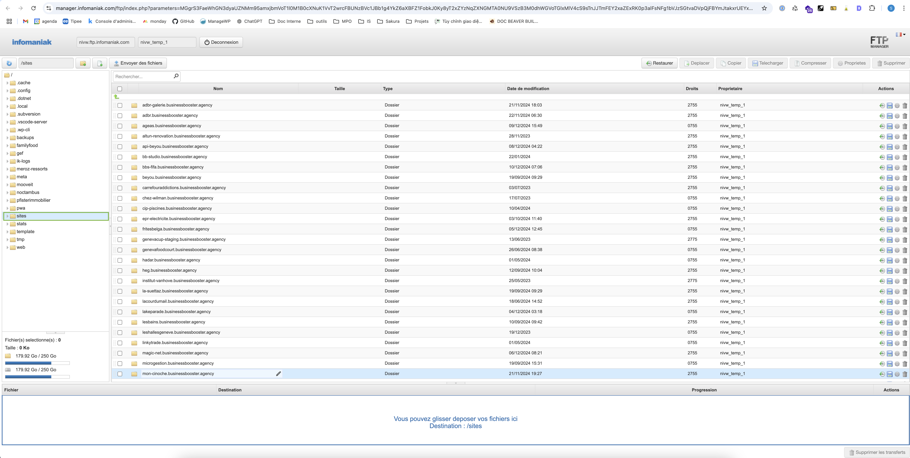
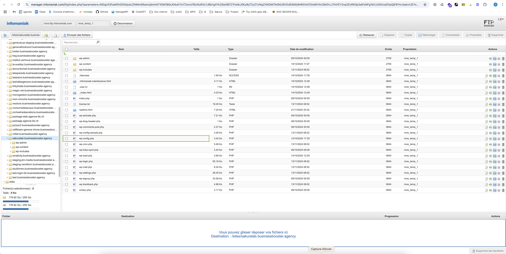
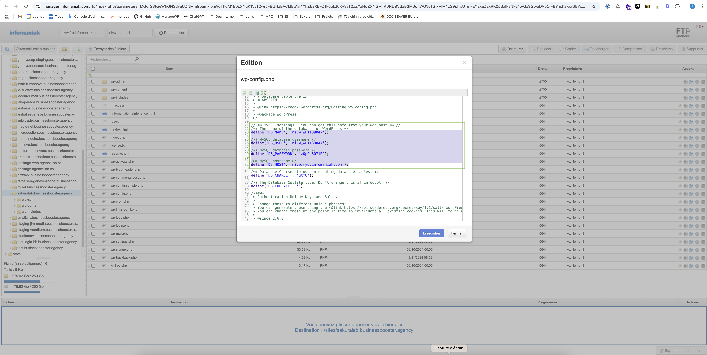
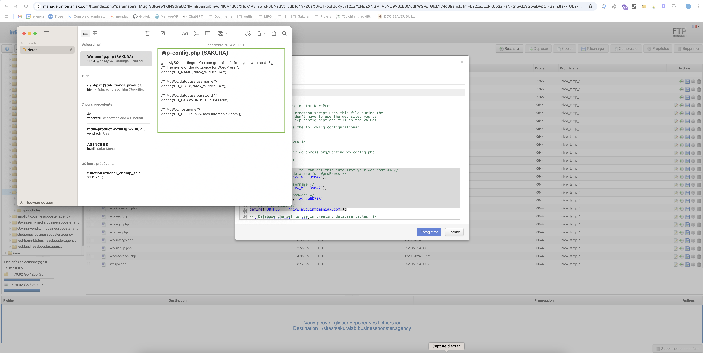

# Copier les informations de la BDD

Une fois la sauvegarde de la base de données effectuée, il est temps d'extraire les informations de connexion à la base de données depuis le fichier `wp-config.php`. Ces informations vous seront nécessaires pour configurer la base de données lors de la migration du site sur le serveur de production.

### 1. Accéder au menu FTP/SSH  
Depuis la page où vous avez lancé le téléchargement de la sauvegarde de la base de données, regardez à gauche dans le menu et cliquez sur l'option **FTP/SSH**. Ensuite, cliquez sur le bouton **Web FTP** pour ouvrir l'interface FTP.  


### 2. Connexion au serveur FTP  
Dans la fenêtre qui s'ouvre, cliquez sur le bouton **Connexion** pour établir la connexion avec le serveur FTP.  


### 3. Naviguer dans les dossiers  
Une fois connecté, naviguez dans le dossier **sites**, puis dans le dossier du site que vous souhaitez migrer.  



### 4. Trouver le fichier `wp-config.php`  
Dans le dossier racine de votre site, cherchez le fichier **wp-config.php**. Double-cliquez dessus pour ouvrir son contenu.  



### 5. Copier les informations de connexion  
Dans le fichier `wp-config.php`, localisez les informations suivantes concernant la base de données :



Ces informations sont essentielles pour connecter votre site à la base de données lors de la migration.

```php
// ** MySQL settings - You can get this info from your web host ** //
/** The name of the database for WordPress */
define('DB_NAME', 'nom_de_votre_base_de_donnees');

/** MySQL database username */
define('DB_USER', 'votre_utilisateur_bdd');

/** MySQL database password */
define('DB_PASSWORD', 'votre_mot_de_passe_bdd');

/** MySQL hostname */
define('DB_HOST', 'votre_hote_bdd');
```

6. **Conserver les informations de connexion**
Gardez ces informations à portée de main, par exemple dans une note, car elles seront nécessaires plus tard dans le processus de migration.

