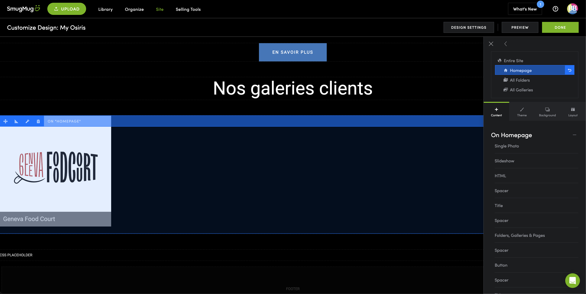
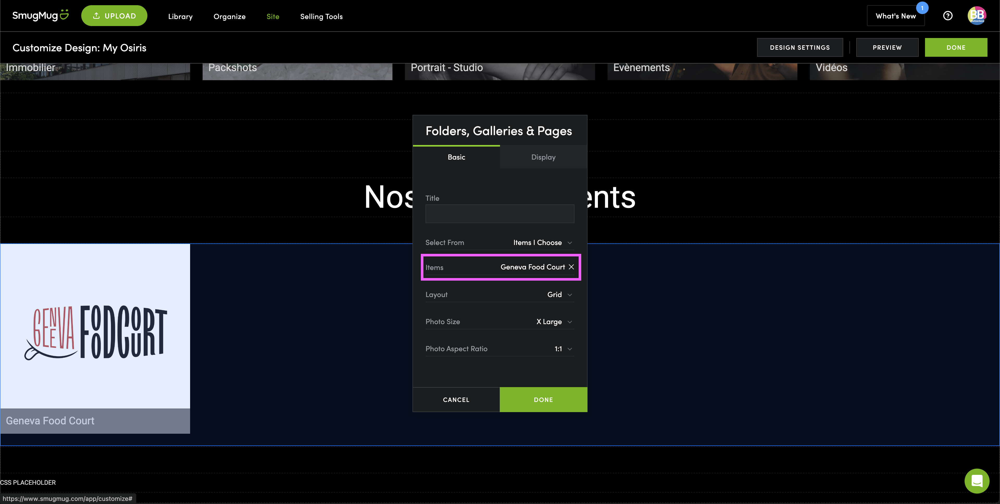

# Ajout d'un Client

Voici le guide pour ajouter un client sur la page d'accueil de la Galerie.

:::danger

L'ajout d'un client ne se fait que si cela a été **validé** au préalable.

:::

:::info

Pour ajouter un client sur la page d'accueil il faut qu'une [**galerie**](./add-gallery.md) ou un [**dossier**](./add-folder.md) soit déjà créé.

:::

1. Rendez-vous sur l'onlet **Site**.
2. Cliquez sur **Customize Design** en haut à droite.
3. Dans la zone ***Nos galeries clients*** et non ~~***Nos Spédialités***~~.
4. Cliquez sur la zone des **Clients**.

5. Cliquez sur **Items***.

6. Selectionnez la **galerie** ou le **dossier** du client.
7. Cliquez sur **Done**.

Et voilà, le client est ajouté sur la page d'accueil :smiley:.

:::warning

Attention a bien avoir **activé le téléchargement** des photos dans les paramètres de la [galerie (étape 8)](./add-gallery.md).

:::