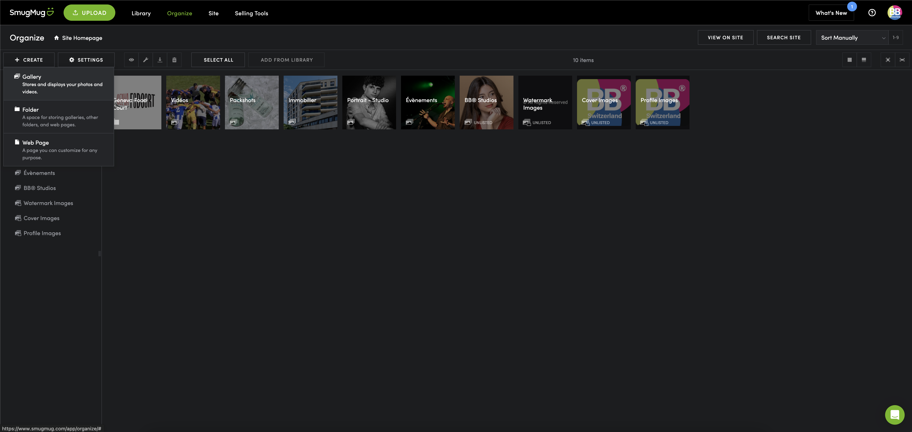

# Ajout d'une Galerie

Une fois connecté à SmugMug rendez-vous dans la l'onglet [Organize](https://www.smugmug.com/app/organize/)

## C'est quoi une galerie dans SmugMug ?

Une galerie est un ensemble de photos. Elle peut être publique ou privée. Elle peut être partagée avec des personnes spécifiques ou avec tout le monde ou protégée par un mot de passe.

:::warning

Une **galerie** peut contenir **que** des photos, des vidéos.

Mais un **dossier** peut contenir **plusieurs galeries**.

:::

## Ajout d'une galerie

1. Cliquez sur le bouton **Create** en haut à gauche de la page.
2. **Gallery**.

3. Donnez un **nom** à votre galerie.
4. Ajouter une **description** si besoin (utile pour le référencement).
5. Ajouter une **feature image** (image de couverture).
6. Sous **Security & Sharing** vous pouvez définir les permissions de la galerie.
     - **Public** : visible par tout le monde.
     - **Unlisted** : visible par tout le monde mais pas référencé.
     - **Private** : visible uniquement par vous.
7. Sous **Access** vous pouvez définir les permissions de la galerie.
     - **Anyone** : visible par tout le monde.
     - **People with password** : visible uniquement par les personnes ayant le mot de passe.
     - **People I choose** : visible uniquement par vous.
8. Sous **Photo Protection** mettez sur **ON** ***Allow Downloads***.
9. Sous **Selling** selectionnez si vous souhaitez vendre les photos de cette galerie.
10. Puis cliquez sur **Create**.

Une fois la galerie créée vous pouvez y ajouter des photos ou des vidéos 📸.