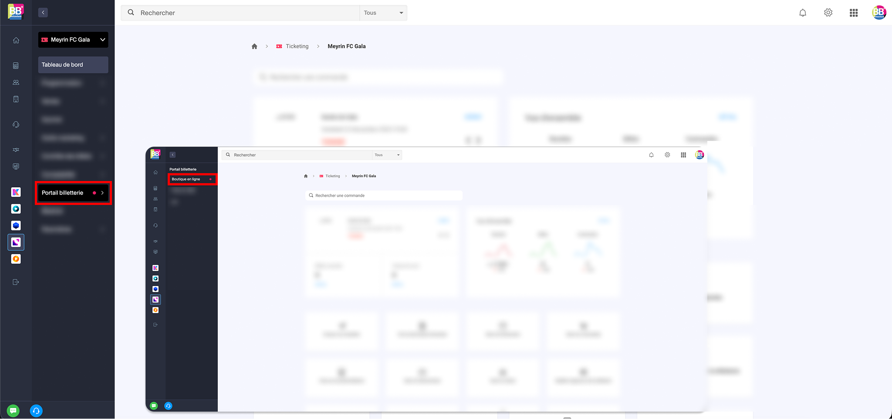
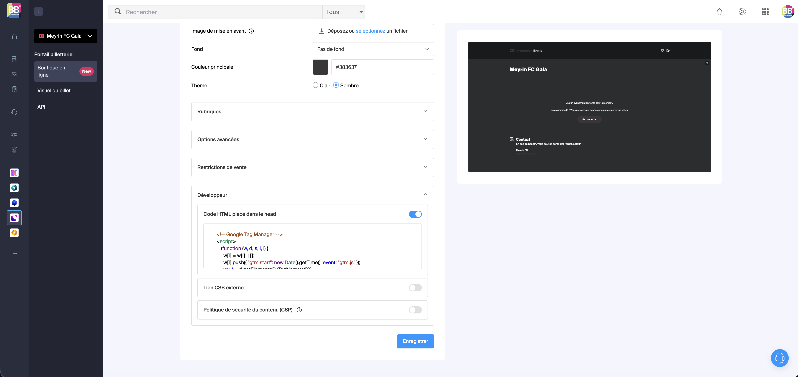
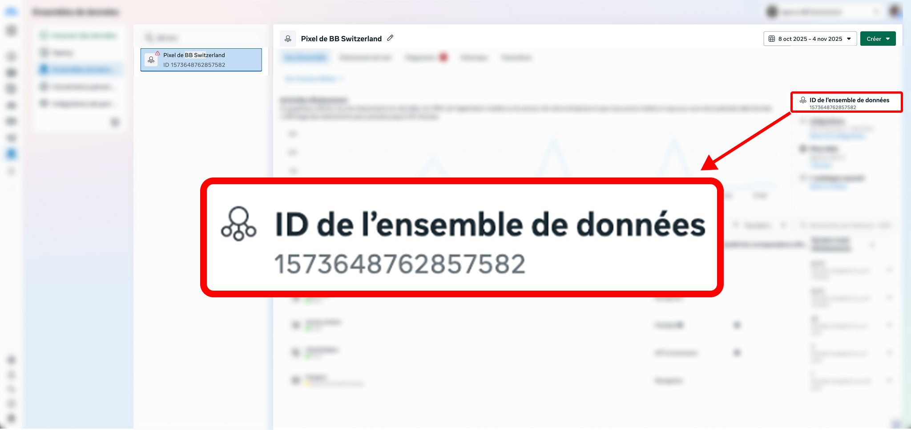
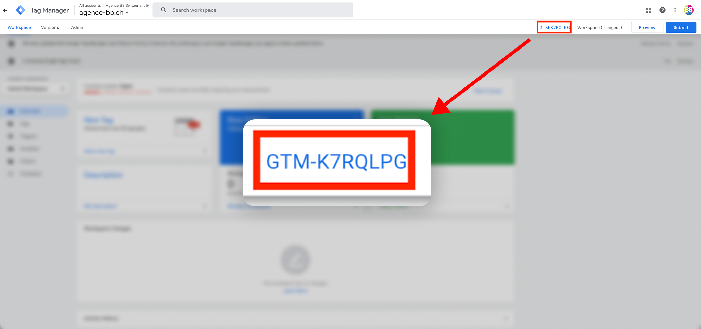
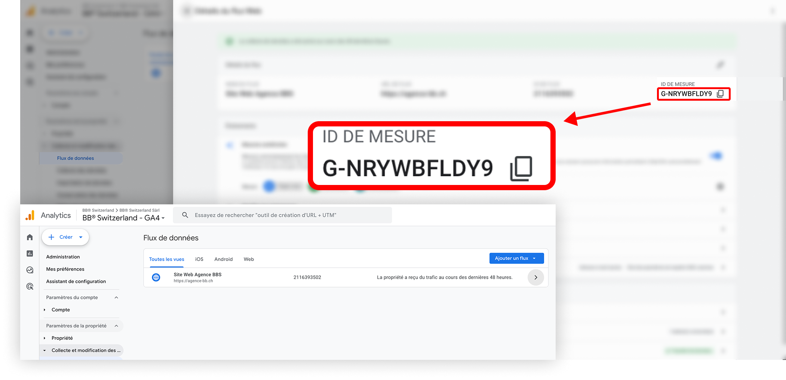

# Tracking Billetterie Infomaniak

:::danger Informations essentielles avant installation

- Les scripts **se placent uniquement dans le header** via **Options Développeur**.
- La billetterie doit **obligatoirement** être une **boutique personnalisée** Infomaniak.
- Les visiteurs doivent accéder à la **URL dédiée** de la boutique (aucune iframe, aucune intégration dans une page externe).

Si ces conditions ne sont pas respectées, **Google Tag Manager ne sera pas chargé**, le Pixel Meta non plus, et **aucun tracking ne fonctionnera**.

:::

---

## Checklist d’installation

1. Ticketing > Votre événement > Portail Billetterie > Boutique en ligne
2. Créer une **boutique personnalisée**
3. Accéder à la billetterie
4. Ouvrir **Développeur**
5. Coller les scripts GTM + Pixel Meta dans **Options Développeur**


<!-- Images -->





---

:::warning
Pensez à bien selectionner votre **évènement** dans l'onglet **Contenu** de la boutique personnalisée pour que votre event soit bien rattaché à la billetterie.
:::

---


## Intégrer GTM + Pixel Meta

:::tip Avant d'ajouter

- Remplacez [`GTM-XXXXXXXX`](#id-gtm), [`G-XXXXXX`](#id-ga4) et [`XXXXXXXXXX`](#id-fb-pixel) par vos identifiants réels.
- Si vous gérez GA4 et Meta via GTM, préférez la configuration via des balises GTM et retirez les scripts directs pour faciliter la maintenance et la gestion du consentement.

:::

```html
<!-- Google Tag Manager -->
<script>
  (function (w, d, s, l, i) {
    w[l] = w[l] || [];
    w[l].push({ "gtm.start": new Date().getTime(), event: "gtm.js" });
    var f = d.getElementsByTagName(s)[0],
      j = d.createElement(s),
      dl = l != "dataLayer" ? "&l=" + l : "";
    j.async = true;
    j.src = "https://www.googletagmanager.com/gtm.js?id=" + i + dl;
    f.parentNode.insertBefore(j, f);
  })(window, document, "script", "dataLayer", "GTM-XXXXXXXX");
</script>
<!-- End Google Tag Manager -->

<!-- Google tag (gtag.js) -->
<script async src="https://www.googletagmanager.com/gtag/js?id=G-XXXXXX"></script>

<!-- Meta Pixel Code -->
<script>
  !(function (f, b, e, v, n, t, s) {
    if (f.fbq) return;
    n = f.fbq = function () {
      n.callMethod ? n.callMethod.apply(n, arguments) : n.queue.push(arguments);
    };
    if (!f._fbq) f._fbq = n;
    n.push = n;
    n.loaded = true;
    n.version = "2.0";
    n.queue = [];
    t = b.createElement(e);
    t.async = true;
    t.src = v;
    s = b.getElementsByTagName(e)[0];
    s.parentNode.insertBefore(t, s);
  })(window, document, "script", "https://connect.facebook.net/en_US/fbevents.js");
  fbq("init", "XXXXXXXXXX");
  fbq("track", "PageView");
</script>
<noscript></noscript>
<!-- End Meta Pixel Code -->
```

---


## Ajouter le script d’événements Infomaniak vers GA4

:::info À propos des événements

Ce script écoute les événements standards émis par la billetterie Infomaniak et les pousse vers GA4 via `dataLayer`/`gtag`. Pensez à :

- Créer les différentes balises pour ces évènements standards (ex. `AddToCart`, `Purchase` pour Meta)
- Tester en mode Aperçu GTM / DebugView GA4 et avec Meta Pixel Helper.
- **Publier**  les modifications du conteneur GTM une fois les tests validés.

:::

Ce script permet de récupérer les événements standards de la billetterie Infomaniak.
Vous pouvez ensuite mapper ces événements vers Meta Pixel dans GTM selon vos besoins.

```html
<script>
  window.dataLayer = window.dataLayer || [];
  function gtag() {
    dataLayer.push(arguments);
  }
  gtag("js", new Date());
  gtag("config", "G-XXXXXX");

  document.addEventListener("ike_event_view", function (e) {
    gtag("event", "view_item", {
      event_category: e.name,
      event_label: e.date,
    });
  });

  document.addEventListener("ike_cart_add", function () {
    gtag("event", "add_to_cart");
  });

  document.addEventListener("ike_cart_confirm", function () {
    gtag("event", "checkout_progress", {
      event_category: "valid cart",
    });
  });

  document.addEventListener("ike_cart_payment_launched", function (e) {
    gtag("event", "add_payment_info", {
      event_category: "paiement",
      event_label: e.detail.currency.name,
      value: e.detail.topaid,
    });
  });

  document.addEventListener("ike_cart_payment_success", function (e) {
    gtag("event", "purchase", {
      event_category: "paiement",
      event_label: e.detail.currency.name,
      value: e.detail.topaid,
    });
  });
</script>
```

<a id="id-fb-pixel"></a>

:::tip pour retrouver l'id de l'ensemble de données de Meta
Allez dans le **Gestionnaire d'événements** de votre compte Meta Business



:::

<a id="id-gtm"></a>

:::tip Pour retrouver l'id du conteneur GTM
Allez dans votre compte Google Tag Manager et copiez l'ID du conteneur



:::

<a id="id-ga4"></a>

:::tip Pour retrouver l'id de mesure GA4
1. **Administration**
2. **Flux de données**
3. Cliquez sur votre flux web
4. Copiez l'**ID de mesure**

