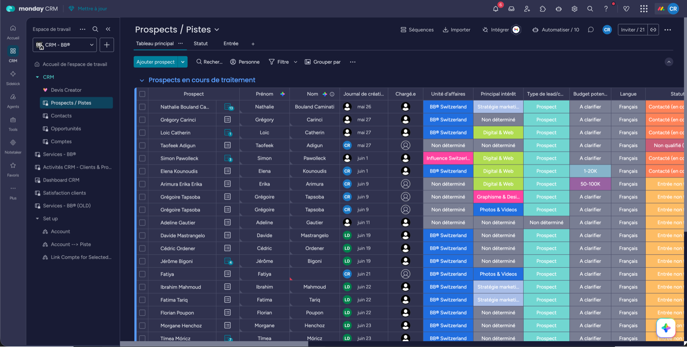
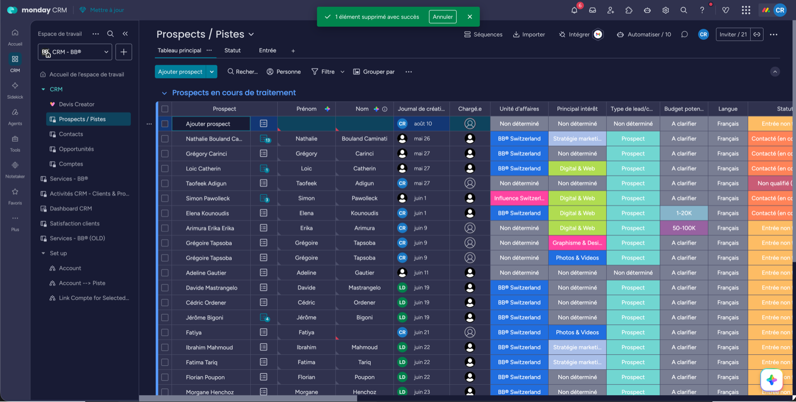

# 1. Ajouter une piste

## Si le lead vient du site ou du chatbot

**Tu n'as rien à faire.** La ligne se crée toute seule et une notif part dans Google Chat.

## Si le lead vient du téléphone ou d'ailleurs

1. Ouvre [Prospects / Pistes](https://agence-bb-ensemble.monday.com/boards/5093138638).
2. Groupe **« Prospects en cours de traitement »**.
3. Clique **+ Ajouter**.
4. Remplis ces 5 champs :

| Champ | Pourquoi |
|---|---|
| **E-mail** | ⚠️ Sans lui, la conversion et Brevo sont bloqués |
| **Origine de la piste** | Pour savoir quel canal rapporte |
| **Unité d'affaires** + **Principal intérêt** | Pour l'orientation |
| **Budget potentiel** | Pour le scoring |
| **Langue** | Pour le devis |

Le reste (secteur, type de contact, raison sociale) se remplit plus tard, au fil des échanges.

## Faire avancer le statut

Une piste suit toujours ce chemin :

**Entrée non traitée** → **Tentative de contact** (tu as essayé de la joindre) → **Contacté** (elle a répondu) → **Qualifié** ou **Non qualifié**.

C'est tout. N'invente pas d'autres statuts.

Le **score** (par tranches de 20 %), c'est Amancio qui le met, et il le fait évoluer après chaque échange.

## Ce qui part tout seul

- Un e-mail de confirmation au prospect.
- Si opt-in newsletter coché : synchro vers **Brevo** (liste 11) via n8n.

## Les 4 erreurs à ne pas faire

| Erreur | Conséquence |
|---|---|
| **E-mail manquant ou faux** | La conversion est bloquée. La pire de toutes. |
| **Créer un doublon** | L'historique du prospect est éclaté sur 2 lignes |
| **Laisser « A clarifier »** alors que tu connais le budget | Le scoring est faussé |
| **Oublier l'origine** | On ne sait plus quel canal rapporte |

---

**Suite →** [Convertir la piste](./convertir-contact-compte.md)
