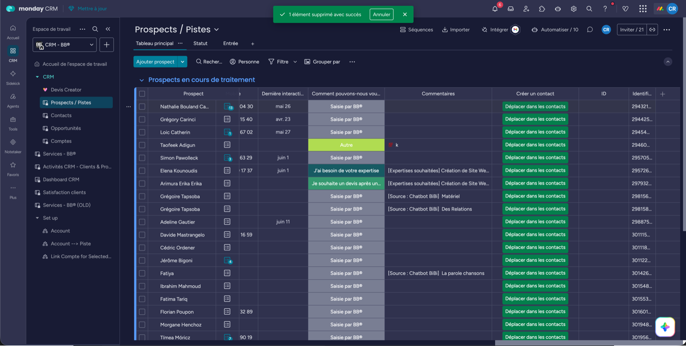

# 2. Convertir la piste

La piste est **Qualifié** ? Tu la transformes en **Contact** (la personne) rattaché à un **Compte** (l'entreprise).

## En 3 clics

1. Ouvre la piste dans [Prospects / Pistes](https://agence-bb-ensemble.monday.com/boards/5093138638).
2. Clique le bouton **« Déplacer dans les contacts »**. Nom, e-mail, tél, société et langue partent tout seuls.
3. Dans le Contact créé, colonne **« Comptes »** : rattache l'entreprise. Si elle n'existe pas, crée-la, puis rattache.

C'est fini. L'adresse et le secteur remontent tout seuls du Compte vers le Contact.

:::danger Jamais de Contact ou de Compte créé à la main
Hors de ce bouton, tu perds l'origine, le score et le lien avec la piste. Si le client est « déjà connu », crée quand même la piste et convertis-la.
:::

:::info Un contact peut avoir plusieurs comptes
Un dirigeant avec deux sociétés, par exemple. C'est normal, rattache-les toutes.
:::

---

**Suite →** [Créer l'opportunité et le devis](./opportunite-devis-creator.md)
