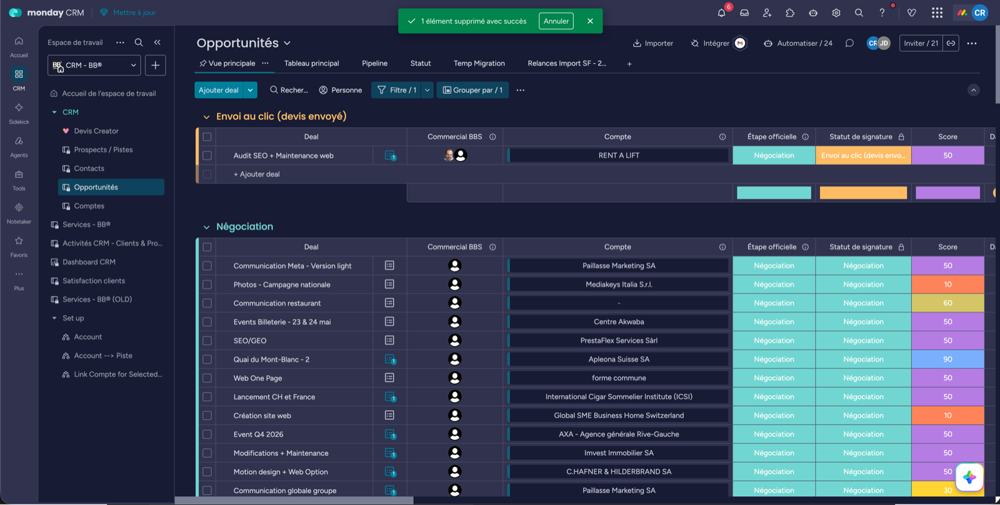
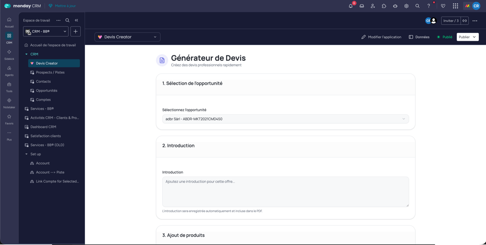
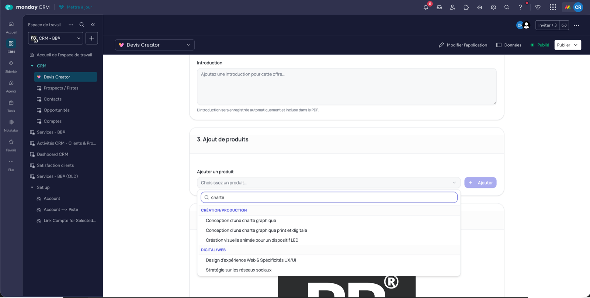
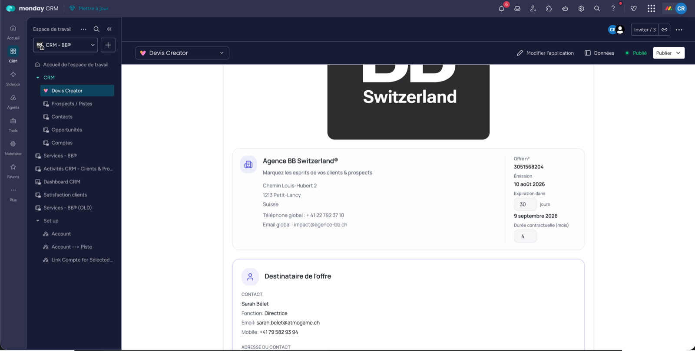
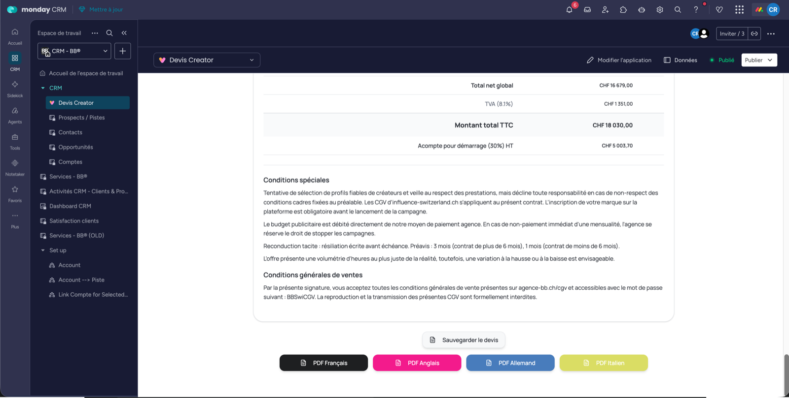
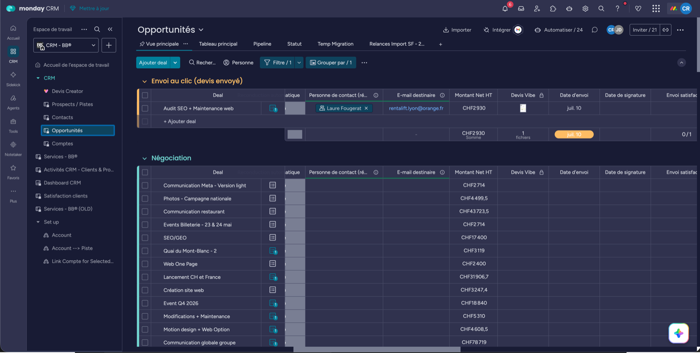
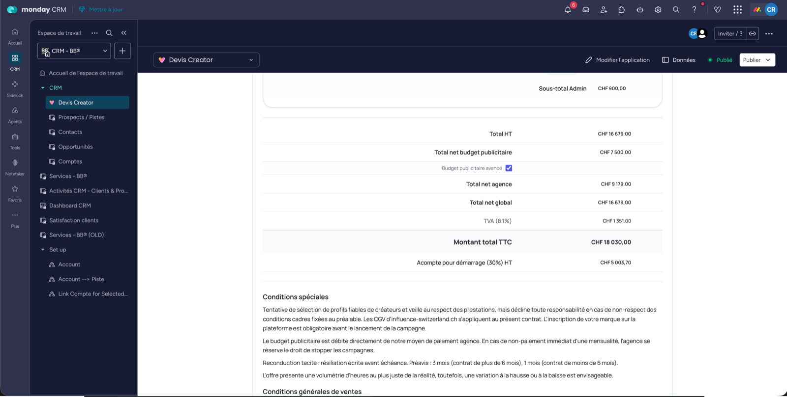

# 3. L'opportunité & le devis

Quatre temps : tu crées le deal, tu montes le devis dans l'app, tu sors le PDF, tu le fais signer.

## A. Créer l'opportunité

Sur le board [Opportunités](https://agence-bb-ensemble.monday.com/boards/5093138639), les groupes = le pipeline (Nouveau, Négociation, Conclu, Perdu).

Remplis : nom du deal, commercial, étape, **compte**, personne de contact. Puis **les deux champs qui comptent** :

- **Introduction** : la présentation du projet
- **Mission** : les précisions contractuelles, tâche par tâche

:::warning Ces 2 champs partiront dans le projet
Sidekick les recopie tels quels dans le projet lors de l'onboarding. Ce que tu écris ici, l'équipe de prod le lira dans 3 semaines. **Introduction vide = projet qui démarre à l'aveugle.**
:::

:::danger Lie bien le Compte à l'opportunité
Le bloc « Coordonnées d'entreprise » du PDF (adresse, téléphone) est tiré du **Compte lié à l'opportunité**, pas de celui du contact. Sans lui, le PDF part sans l'adresse du client.
:::

Ne touche pas au **Montant Net HT** : l'app le réécrit en continu pendant que tu montes le devis.

## B. Monter le devis dans Devis Creator

Ouvre l'onglet de l'app depuis l'item de l'opportunité : elle sélectionne l'opportunité toute seule.

1. **Vérifie l'opportunité sélectionnée.** L'app n'affiche que les statuts de signature *Nouveau*, *Négociation* et *Envoi au clic*.
2. **Édite l'Introduction.** Elle est enregistrée dans la colonne Introduction de l'opportunité.
3. **Ajoute les produits** depuis le catalogue Services - BB®, groupés par catégorie.
4. **Renseigne la Mission** service par service si besoin. Toutes les Missions sont recopiées (sans doublon) dans la colonne Mission de l'opportunité, et chacune apparaît dans sa ligne du PDF.

### Les réglages du devis

| Réglage | Portée | À savoir |
|---|---|---|
| **Quantité** | par produit | Décimales et fractions acceptées (`1/2`) |
| **Prix manuel** | par produit | ⚠️ Obligatoire sur les produits à 0 (budget pub, UX/UI, droits) |
| **Rabais %** | par catégorie | De 0 à 100 |
| **Durée contractuelle** | ⚠️ **globale, tout le devis** | Multiplie les produits en récurrence *mensuel*. 12 mois par défaut. |
| **Devise** | globale | CHF, EUR, USD (taux du jour) |
| **Budget publicitaire avancé** | globale | Change le calcul de l'acompte (voir plus bas) |
| **Expiration** | globale | 30 jours par défaut |

Tu peux aussi **réordonner les catégories** (flèches ↑↓) : le PDF respecte cet ordre.

:::warning Le prix manuel n'est pas converti
Un prix saisi à la main est repris **tel quel**, sans conversion de devise. Si ton devis est en EUR, saisis-le directement en EUR.
:::

:::danger Ne modifie jamais le board Services - BB®
C'est la source des prix, des heures et des sous-tâches de toute l'agence. Une modif se propage à **tous** les devis et **tous** les projets futurs.

Un service n'apparaît pas dans la liste ? Il n'est pas en statut **active** dans le catalogue.
:::

:::tip Tu peux partir et revenir
Le devis est sauvegardé (produits, quantités, rabais, devise, durée…) et rechargé automatiquement à la réouverture. Le bouton **Sauvegarder** force l'enregistrement sans générer de PDF.
:::

## C. Sortir le PDF

Quatre boutons de langue : **FR / EN / DE / IT**. Un clic et l'app :

- rafraîchit les taux de change,
- dépose le PDF dans la colonne « Devis Vibe » de l'opportunité,
- écrit le **Montant Net HT**,
- pose la **date d'expiration**.

Le PDF contient le logo, les coordonnées client, un tableau par catégorie (*Nom du service · Description · Mission · Qté · Prix HT · Total HT*), les conditions spéciales, les totaux, le bloc signature et le lien vers les CGV.

:::note Les traductions viennent du catalogue
Les noms, descriptions et conditions spéciales en EN / DE / IT sont lus dans les colonnes correspondantes de Services - BB®. Si elles sont vides là-bas, elles seront vides dans le PDF.
:::

## D. Envoyer & faire signer

1. Passe le **Statut de signature** à « Envoi au clic (devis envoyé) ».
2. Télécharge le PDF depuis la colonne Devis Vibe.
3. Réimporte-le dans **DocuSign**, place les champs signature / nom / date à la main, envoie.

Le document signé revient dans monday, le statut passe à **Signé**. Une relance part automatiquement tous les 3 jours.

:::warning Le placement des champs DocuSign est manuel
C'est une limite de DocuSign, pas un oubli de config. Tu devras le refaire à chaque envoi.
:::

## Avant de cliquer « envoyer »

- [ ] Le **Compte** est lié à l'opportunité (sinon adresse vide dans le PDF)
- [ ] **Introduction** rédigée (elle part dans le projet)
- [ ] **Prix manuel** saisi sur chaque produit à 0, sinon la ligne part à zéro chez le client
- [ ] **Durée contractuelle** correcte : elle s'applique à *tout* le devis, pas produit par produit
- [ ] **Devise** correcte, et prix manuels saisis dans cette devise
- [ ] **Budget publicitaire avancé** coché ou décoché selon l'accord, ça change l'acompte
- [ ] PDF dans la bonne langue, présent sur l'opportunité

## Les totaux et l'acompte

:::danger L'acompte, c'est 30 % du HT, jamais du TTC
:::

| Cas | L'acompte porte sur |
|---|---|
| Pas de budget publicitaire | **Total net global** |
| Budget pub **avancé par l'agence** (par défaut) | **Total net global** |
| Budget pub **non avancé** | **Total net agence** seulement (les honoraires) |

Le détail des totaux, avec un exemple chiffré

Le budget publicitaire est isolé du reste : ce n'est pas une prestation d'agence.

Chaque ligne = **prix × quantité × durée contractuelle** (la durée ne s'applique qu'aux produits en récurrence *mensuel*). Le rabais s'applique ensuite par catégorie.

Exemple : 3 000.- de Création + 5 000.- de Digital (rabais 10 %) + 2 000.- de budget pub.

| Ligne | Montant |
|---|---|
| Total HT | 10 000.00 |
| Total des rabais | − 500.00 |
| Total net budget publicitaire | 2 000.00 |
| Total net agence | 7 500.00 |
| **Total net global** | **9 500.00** |
| TVA 8.1 % | 769.50 |
| **Montant total TTC** | **10 269.50** |
| Acompte 30 % HT, budget avancé | **2 850.00** |
| Acompte 30 % HT, budget non avancé | 2 250.00 |

La ligne « Total des rabais » n'apparaît dans le PDF que s'il y a un rabais. La ligne « Total net budget publicitaire » n'apparaît que s'il y a un produit de cette catégorie.

Les taux de change

Les taux CHF → EUR / USD sont récupérés en direct sur une API publique, au chargement de l'app **et** au moment de générer le PDF.

Si l'API ne répond pas, l'app retombe sur des taux de secours (EUR 0.95, USD 1.08). Sur un devis en devise étrangère, vérifie les montants avant d'envoyer.

---

**Devis signé ? →** [Monter le projet avec Sidekick](../02-work-management/onboarding-projet-sidekick.md)
