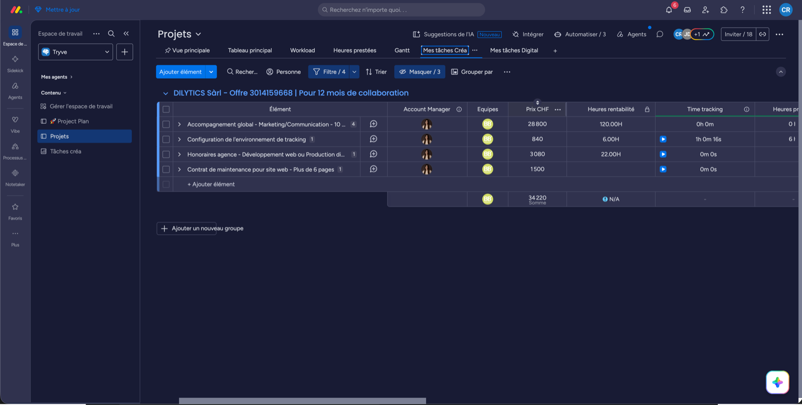
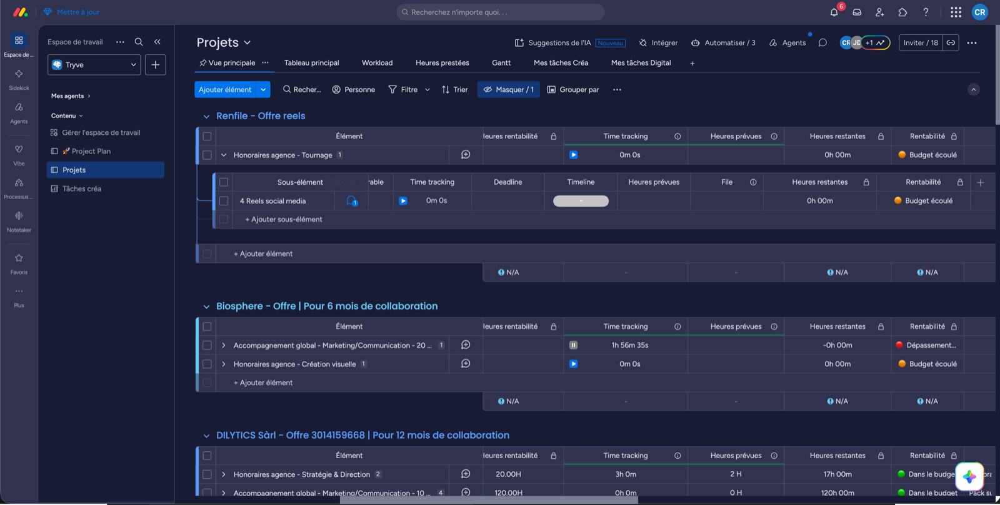

# Gérer mes tâches

Le projet est monté. Voici ton quotidien dessus.

## 1. Ouvre ta vue

**« Mes tâches Créa »** ou **« Mes tâches Digital »** : tes tâches à toi, filtrées sur ton pôle. C'est la vue à ouvrir chaque matin.

## 2. Prends la tâche

Passe le sous-élément en **En cours de production**. La date de démarrage se remplit toute seule.

La colonne s'appelle **« Prise de la Mission »**. Ses 4 valeurs :

**Non récupérée** → **En cours de production** → **Terminée**, ou **Bloqué** si tu attends quelque chose (dépendance, retour client).

## 3. Remplis les 6 colonnes

Tout se joue au niveau du **sous-élément**, jamais de l'élément.

| Colonne | À quoi elle sert |
|---|---|
| **Heures prévues** | Le budget de la tâche. Base du calcul de rentabilité. |
| **Responsable mission** | Qui exécute la tâche. |
| **Timeline** | Date de début et date de fin. ⚠️ C'est elle qui alimente le **Workload**. |
| **Deadline** | La date à laquelle la tâche doit être livrée. |
| **Prise de la Mission** | Où en est la tâche. |
| **Time tracking** | Le temps réellement passé. |

:::warning Sans ça, la tâche n'existe pas pour le système
Il manque les heures prévues ? Pas de rentabilité. Il manque la Timeline ou le responsable ? La tâche est invisible dans le Workload, donc personne ne voit ta charge de travail.
:::

## 4. Encode tes heures

Le time tracking se met **sur le sous-élément**, pas sur l'élément.

**Heures prévues** (héritées du catalogue Services) − **ton time tracking** = **heures restantes** et **rentabilité**.

| Couleur | Ça veut dire |
|---|---|
| 🟢 Vert | Dans le budget |
| 🟠 Orange | Budget écoulé |
| 🔴 Rouge | Dépassement |

Ça se lit à deux niveaux : la tâche, et le service qui la contient.

## Si tu es à la Créa

Trois colonnes en plus, à remplir sur les livrables :

| Colonne | Valeurs |
|---|---|
| **Phases créa** | Pré-production · Production · Post-Prod · Validation |
| **Statuts créa** | À faire · En Brief · En Tournage · En Montage · En Validation · Terminé |
| **Type de Livrable** | Photo · Vidéo · Motion Design · Graphisme 2D |

:::note Statuts Digital : pas encore figés
À définir avec Emmanuel. Phases pressenties : Conception · Maquettage · Validation client · Développement · Contrôle qualité · Mise en ligne.
Les liens Figma et ressources externes se mettent directement dans l'élément.
:::

## Les autres vues

| Vue | Pour quoi |
|---|---|
| **Workload** | La charge de travail par personne |
| **Heures prestées** | Le time tracking consolidé |
| **Gantt** | Le planning du projet |
| **Vue principale** | Tout le board |

## Questions fréquentes

**Ma tâche n'apparaît pas dans le Workload.** Il lui manque forcément un de ces 3 champs : **Responsable mission**, **Timeline**, **Heures prévues**.

**Je ne vois pas une tâche dans ma vue.** C'est la colonne **« Équipes »** qui pilote les filtres. Tu ne la remplis pas : elle vient du catalogue Services - BB® et Sidekick l'injecte à l'onboarding. Un service peut appartenir à plusieurs équipes (un shooting mobilise Créa + Photo) et apparaître dans plusieurs vues, c'est voulu.

**Qui m'assigne ?** Personne automatiquement. Sidekick assigne à l'**équipe**, puis le responsable de pôle répartit nominativement.

**Et les dépendances ?** Manuelles. Plus de 125 combinaisons de services possibles, aucune règle automatique ne tient.

Une notification part au chef de projet quand un service passe en « Done ».
