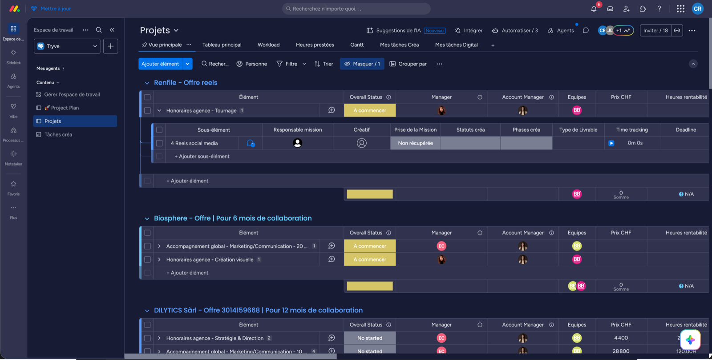

# Comment les projets sont organisés

**Le travail vit dans un seul board :** [Projets](https://agence-bb-ensemble.monday.com/boards/5097430798) (workspace BBS® - Work Management). Tous les clients, tous les projets.

Un second board, [Tasks BBS](https://agence-bb-ensemble.monday.com/boards/5102159651), agrège toutes les tâches pour le **pilotage** : c'est là qu'on voit qui fait quoi, par pôle et par personne. Il ne contient aucune donnée propre, tout y est miroir de Projets.

## La seule règle à retenir

| Niveau | = | Exemple |
|---|---|---|
| **Groupe** | Une offre signée | « VENDITUM - Offre 2961195802 \| Pour 1 mois » |
| **Item** | Un service vendu | « Pré-production pour prise de vue » · 590.- · 4 h |
| **Sous-item** | Une étape de travail | « Storyboarding » · 2 h 30 |

Concrètement :

- 📁 **Groupe** : VENDITUM - Offre 2961195802 | Pour 1 mois de collaboration
  - 📄 **Item** : Pré-production pour prise de vue (storyboard) · 590.- · 4 h · Shooting/Tournage
    - Réception brief · 1 h 30
    - Présentation équipe · 0 h 30
    - Validation client · 0 h 52
    - Storyboarding · 2 h 30
  - 📄 **Item** : un par ligne du devis, dans l'ordre exact

## Les 3 guides

1. **[Onboarder un projet](./onboarder-un-projet.md)** : transformer un devis signé en projet.
2. **[Attribuer les tâches](./attribuer-les-taches.md)** : qui fait quoi, quand — et les colonnes sans lesquelles rien ne remonte.
3. **[Gérer mes tâches](./gerer-mes-taches.md)** : ton quotidien, statuts, heures, rentabilité.

Pourquoi un seul board et pas un board par client ?

La licence **Pro** plafonne à 20 tableaux connectés et 5 workflows actifs. Un board par client serait ingérable en quelques mois.

Bonus : reporting global sur tous les projets, rentabilité à deux niveaux (tâche et service), Workload par équipe.

