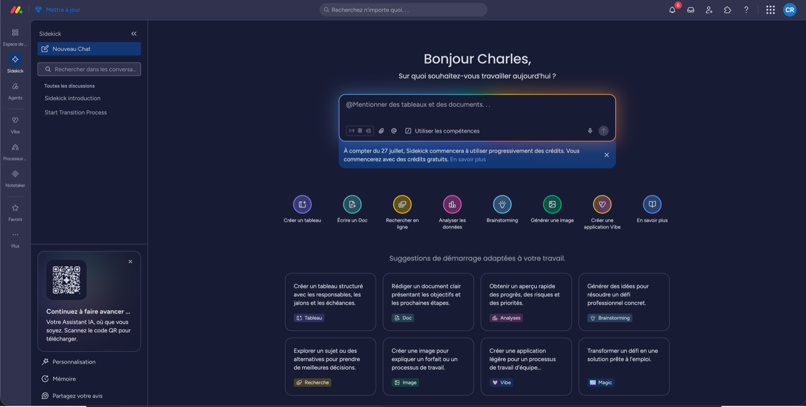
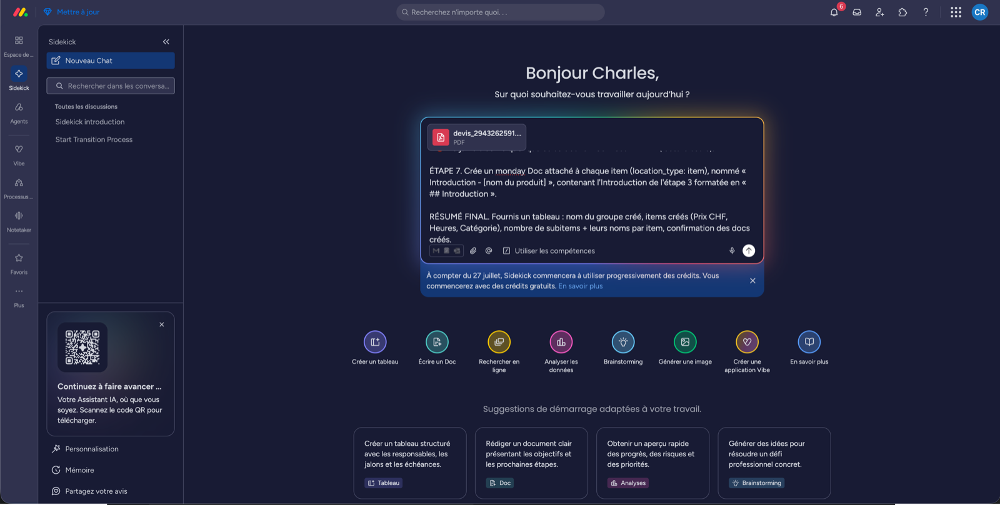

# Monter un projet depuis un devis

Le devis est signé ? **Sidekick** (l'IA de monday) monte le projet tout seul à partir du PDF. Ça prend quelques minutes.

## Avant de commencer

- [ ] L'opportunité est en statut **Signé**
- [ ] Le **PDF du devis** est dans la colonne « Devis Vibe »
- [ ] Tu as accès à **Sidekick**

## La procédure

1. Ouvre la page **[Prompt Sidekick](../03-reference/prompt-sidekick.md)**.
2. Copie le prompt **en entier**, n'en retire rien, ne le « simplifie » pas.
3. Colle-le dans Sidekick et **joins le PDF du devis signé**.
4. Laisse tourner. Sidekick finit par un tableau récapitulatif.

## Vérifie son travail

Sidekick se trompe parfois. Contrôle ces 6 points :

- [ ] Le **groupe** porte le bon nom (entreprise, n° d'offre, durée)
- [ ] **Un item par ligne du devis**, avec prix, heures et catégorie
- [ ] Les items sont **dans le même ordre que le PDF** (c'est l'ordre contractuel)
- [ ] Les **sous-items** sont là, dans l'ordre, avec leurs heures
- [ ] Chaque item a son **doc « Introduction »**, et il n'est pas vide
- [ ] Le **Responsable** est assigné : Emmanuel pour Digital, Estefanía pour la Créa

## Si quelque chose cloche

| Symptôme | Cause | Quoi faire |
|---|---|---|
| **Pas de sous-items** | Sidekick n'a pas exécuté la requête GraphQL du prompt | Relance avec le prompt complet |
| **Items dans le désordre** | Sidekick a réordonné | Remets-les dans l'ordre du PDF à la main |
| **Doc « Introduction » vide** | L'Introduction était vide sur l'opportunité | Remplis-la [sur l'opportunité](../01-crm/opportunite-devis-creator.md), relance |
| **Téléphone invalide** | Caractères invisibles copiés du PDF | Retape le numéro à la main |

:::danger Deux interdits absolus
1. **Ne jamais écrire dans Services - BB®.** Sidekick le lit, il ne l'écrit pas, toi non plus.
2. **Ne jamais retirer la requête GraphQL du prompt.** Sans elle, tes projets arrivent vides de leurs étapes.
:::

Ce que Sidekick fait exactement (pour comprendre / débuguer)

1. Il lit le PDF : entreprise, n° d'offre, durée, liste des produits dans l'ordre.
2. Il cherche chaque produit dans **Services - BB®** pour récupérer prix, heures, équipes, catégorie, description. Puis **ses sous-éléments via GraphQL**.
3. Il retrouve l'opportunité pour en tirer l'Introduction, la Mission et l'e-mail du contact.
4. Il crée le **groupe** dans Projets.
5. Il crée les **items**, un par produit, dans l'ordre du devis.
6. Il crée les **sous-items**, dans l'ordre.
7. Il crée un **monday Doc « Introduction »** attaché à chaque item.

L'étape 2 est la plus fragile : le chargement standard d'un item monday **ne renvoie pas ses sous-éléments**. Sans la requête GraphQL explicite, Sidekick conclut à tort que le service n'en a pas.

Pourquoi Sidekick et pas une vraie automatisation ?

Décision du Workshop #4. L'essentiel de l'info est dans le PDF, pas dans des colonnes structurées. Pour 3 à 6 projets par mois, une automatisation complète coûterait plus cher à construire et à maintenir qu'elle ne ferait gagner.

---

**Suite →** [Piloter le projet](./executer-projet.md)
