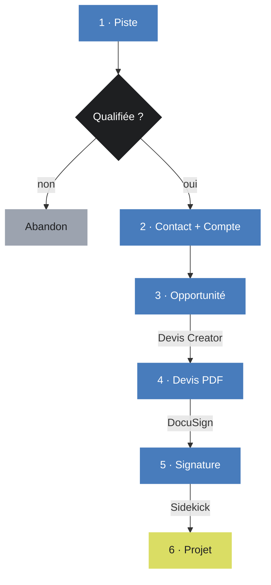

# Monday chez BB® Switzerland

**monday.com remplace Salesforce.** Tout est sur `agence-bb-ensemble.monday.com` : les clients (CRM) et les projets (Work Management).

## Le parcours

Une fois le projet créé, il porte ses heures, ses statuts et sa rentabilité.

## Où aller

| Tu veux… | Va ici |
|---|---|
| Entrer un lead, faire un devis | **[CRM](./01-crm/index.md)** |
| Monter un projet, suivre tes heures | **[Work Management](./02-work-management/index.md)** |
| Un ID de colonne, le prompt Sidekick | **[Référence](./03-reference/boards-et-colonnes.md)** |

:::warning L'ancien process est mort
Salesforce → macro Excel → import Monday : **ne l'utilise plus**. Tout passe par [Sidekick](./02-work-management/onboarding-projet-sidekick.md).
:::

Pourquoi un seul board pour tous les projets ?

Notre licence monday est une **Pro** : 5 workflows actifs et 20 tableaux connectés maximum. Un board par client serait ingérable.

Et comme on traite 3 à 6 projets par mois, l'onboarding semi-automatique via Sidekick (quelques minutes) coûte moins cher qu'une automatisation lourde.

