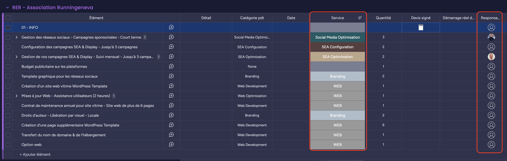

# Onboarding client BBS

:::warning
➡️ **+1 jour** après le changement du statut en « signé » dans Salesforce, un lien apparaît dans le canal **`onboarding-monday`**.
:::

---

## **Objectif de l’onboarding**

Reprendre les lignes du devis et les intégrer dans le board **Monday** « Onboarding ».

---

## **Fichier à utiliser**

📄 **Macro Excel pour l’onboarding**  
[smb://10.1.1.230/BB_Team/Processus/ONBOARDING/onboarding_template_def.xlsm](smb://10.1.1.230/BB_Team/Processus/ONBOARDING/onboarding_template_def.xlsm)

---

## **Étapes détaillées**

| **Étape** | **Outil** | **Action** |
|------------|-----------|------------|
| 1 | **Salesforce** | Copier les lignes du devis |
| 2 | **Excel** | Ouvrir le fichier `onboarding_template_def.xlsm` et coller les lignes |
| 3 | **Excel** | Sous **Développeur > Macro > Exécuter** (ou raccourci `cmd + option + n`) |
| 4 | **Excel** | Enregistrer une copie en `.xlsx`   ➡️ Renommer : **« Nom du Client – Nom de l’opportunité.xlsx »** |
| 5 | **Monday** | Importer les éléments   ➡️ Champ **« produit »** comme première ligne de référence   ➡️ Vérifier le **mapping** (normalement automatique, sauf champ « groupe » à remplir) |
| 6 | **Monday** | Ajouter le **devis signé** dans la colonne dédiée (**au niveau de l'élément : 01 – INFO**) |
| 7 | **Monday** | Remplir la colonne **Responsable** :   ➡️ **Emmanuel** ou **Estefania**, selon les pôles à activer (si pas déjà rempli automatiquement) |

---
## **Automatisations sur Monday**

✅ **Automatique :**  
- **Colonne « Service »** : remplissage via l'IA (basé sur la colonne **Catégorie pdt** depuis Salesforce)  
- **Colonne « Responsable »** :  
  - **Dany** ➡️ Gestion des RS  
  - **Maël** ➡️ Gestion SEA

:::warning
⚠️ **À vérifier :**  
- **Étiquette IA (Service)** : la vérification manuelle est recommandée, l'IA peut se tromper  
- **Organisation future** : prévoir une mise à jour du process si les équipes Social Ads ou SEA s’agrandissent (création d'autres équipes dans Monday)
:::

---

---

### 👉 Astuces :
- Utilise **les emojis** pour rythmer le texte.
- Un **tableau** marche super bien pour les séquences d'actions.
- Tu peux aussi faire un **schéma** pour montrer l’enchaînement si besoin !
