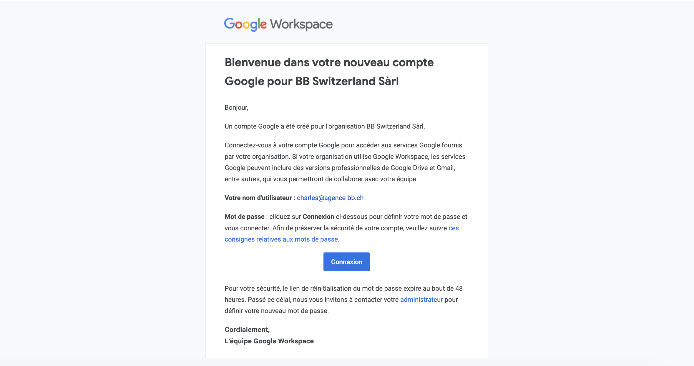

# Google

A l'agence on utilise beaucoup les outils Google pour les emails, le calendrier, les documents, les google sheets.

Tu as reçu un mail sur ton adresse e-mail personnelle de l'agence pour te connecter à ton compte Google avec cet objet : `Un compte Google a été créé pour BB Switzerland Sàrl`. Si tu n'as pas reçu ce mail, demande à ton manager.

Tu peux maintenant te connecter à ton compte Google.

:::warning

Il faut impérativement activer l'authentification à deux facteurs pour des raisons de sécurité. Si tu ne l'as pas fait, tu ne pourras pas te connecter à ton compte Google dans 1 semaine.

Tu peux activer l'authentification à deux facteurs avec **Google Authenticator** suivant ce lien : [https://myaccount.google.com/signinoptions/twosv](https://myaccount.google.com/signinoptions/twosv)

:::