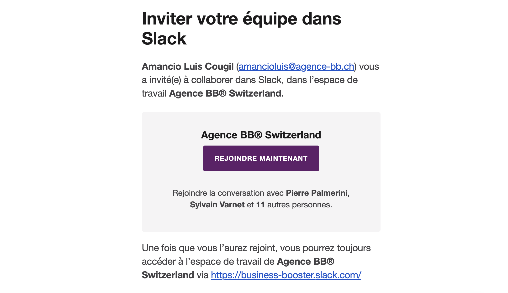

# 💬 Slack

Slack est l'outil de communication principal de l'agence. C'est là que tu trouveras toutes les informations importantes, les discussions avec tes collègues, les notifications, etc.

## Accès à Slack

Tu as dû recevoir un mail avec l'objet `Amancio Luis Cougil vous a invité(e) à collaborer dans Slack` contenant tes identifiants de connexion. Si tu ne l'as pas reçu, tu peux demander à ton manager de te les renvoyer.

### Pour te connecter:

1. Connecte-toi avec ton compte Google en cliquant sur le lien dans le mail.

:::tip

Tu peux utiliser Slack directement dans ton navigateur ou depuis l'application sur ton ordinateur ou ton téléphone.

:::

