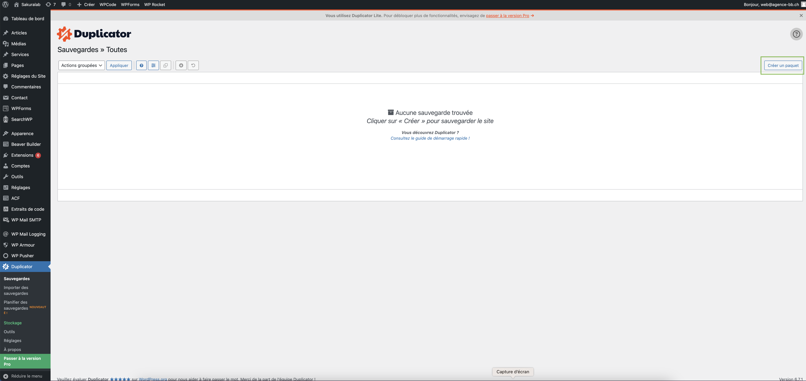
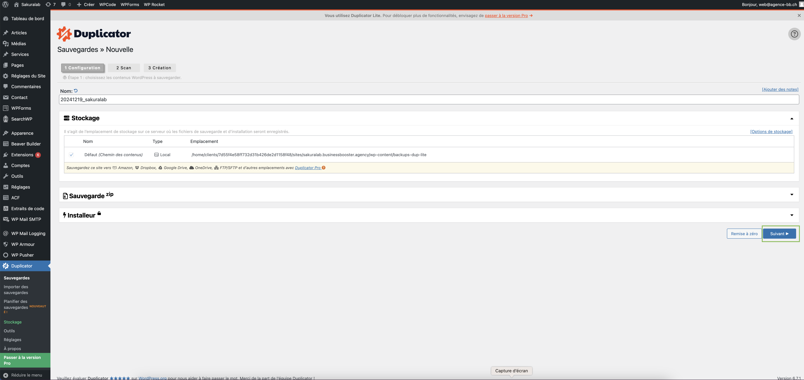
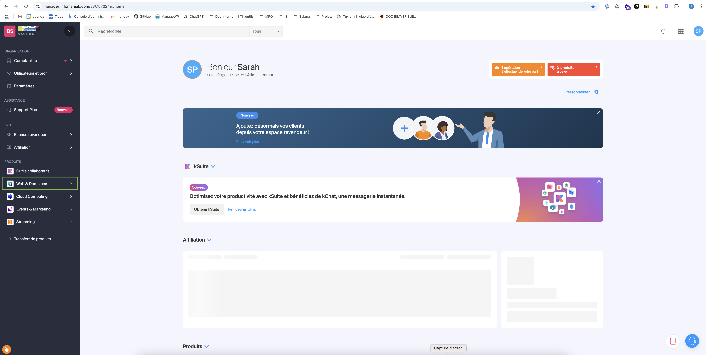
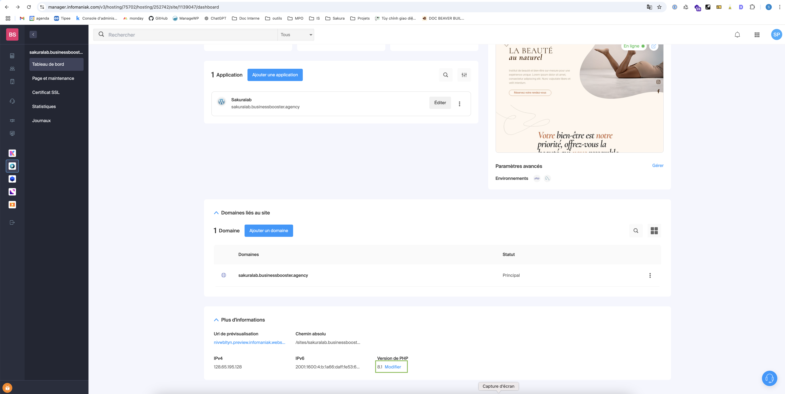
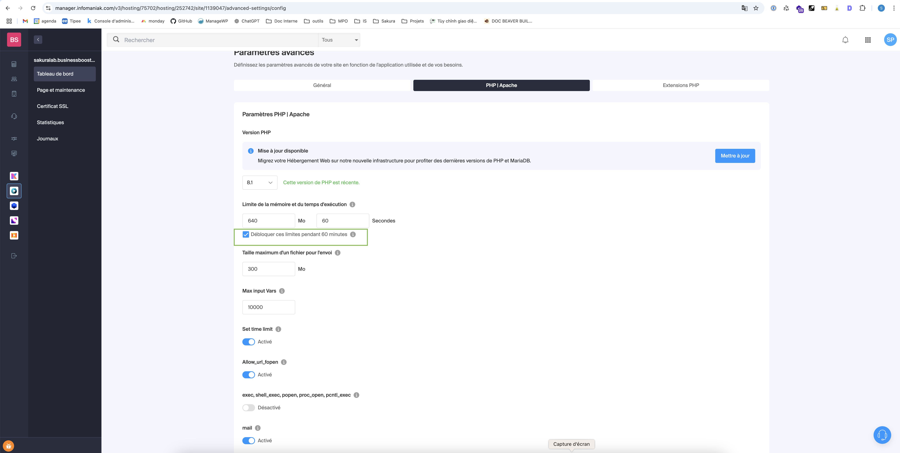
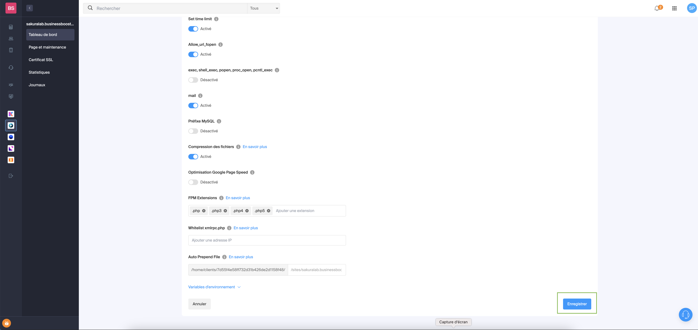

# Création du paquet pour la migration

L'outil **Duplicator** est un plugin WordPress permettant de créer une copie complète de votre site, incluant la base de données et tous les fichiers nécessaires à sa mise en ligne sur un nouveau serveur. Cette étape vous guidera dans l'installation du plugin Duplicator et la création du paquet de migration.

### Installer le plugin "Duplicator" sur le site WordPress à migrer  
Depuis le tableau de bord WordPress de votre site, accédez au menu **Extensions** puis cliquez sur **Ajouter**.  

### Installer Duplicator  
Dans la barre de recherche en haut à droite, tapez "Duplicator" et cliquez sur **Installer maintenant**

  

Une fois l'installation terminée, cliquez sur **Activer** pour activer le plugin sur votre site.

### Débloquer la limite de taille des fichiers téléchargés  
Avant de commencer la création du paquet de migration avec Duplicator, il est nécessaire de débloquer la limite de taille des fichiers téléchargés sur votre serveur. Voici les étapes à suivre :

1. Connectez-vous à la plateforme Infomaniak et, dans le menu à gauche, cliquez sur **Web & Domaines**.  
   
   

2. Dans le menu qui apparaît, sélectionnez **Site Web**.  

   

3. Recherchez votre site dans la liste et cliquez dessus pour accéder à sa gestion.  

   

4. Dans la fenêtre qui s'ouvre, faites défiler la page jusqu'à la section **Version PHP** en bas et cliquez sur **Modifier**.  

   

5. Cochez la case **Débloquer ces limites pendant 60 minutes**.  

   

:::warning
**Important :** Avant d'enregistrer les modifications, assurez-vous d'être prêt à lancer immédiatement la création du paquet de migration avec Duplicator. Cette étape peut prendre un peu de temps, en fonction de la taille de votre site. La dérogation de la limite de taille est temporaire (60 minutes).
:::

1. Cliquez sur le bouton **Enregistrer** en bas à droite pour enregistrer les modifications.  

   

### Création du paquet
