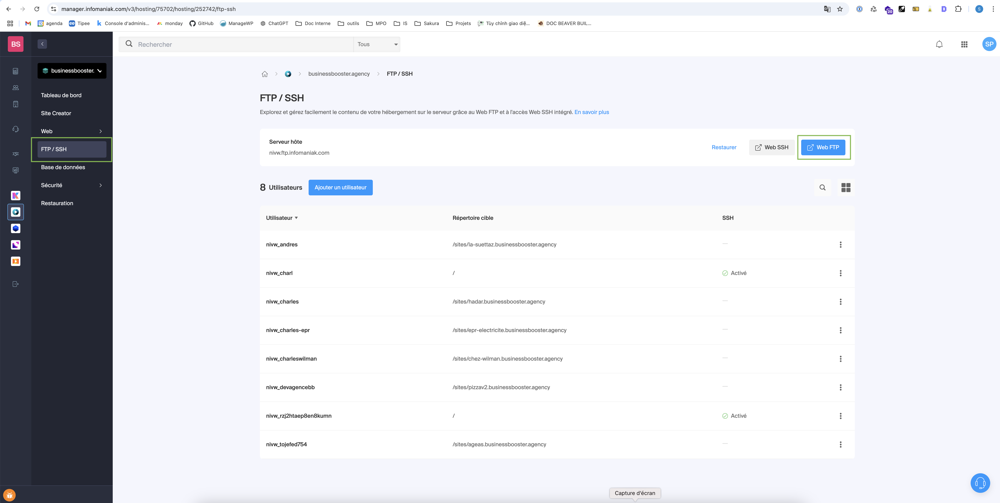
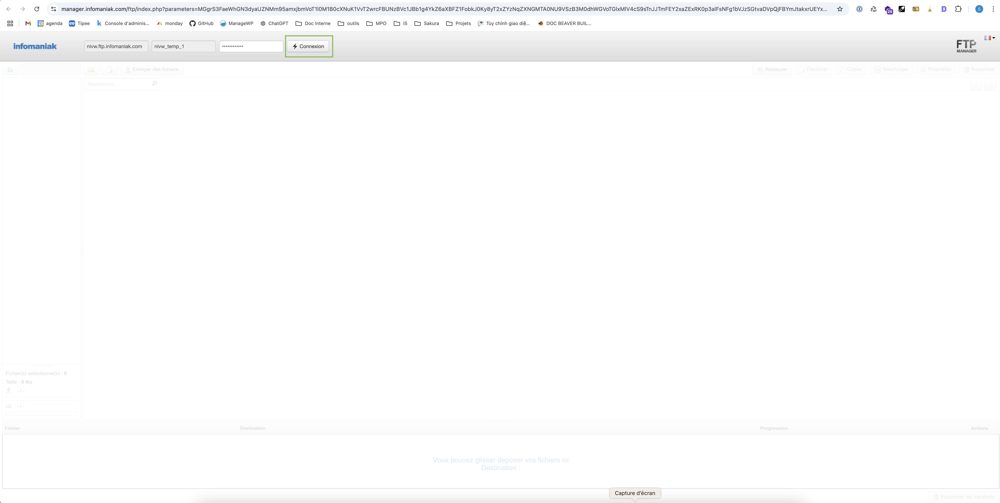

# Migration

Ce guide décrit les étapes nécessaires pour migrer votre site WordPress vers un nouveau domaine en utilisant le service FTP d'Infomaniak

### 1. Accéder au menu FTP/SSH

Rendez-vous sur le domaine du site pour la mise en ligne (utilisez le nouveau domaine que vous avez créé à l'étape précédente).

1. Une fois connecté, cliquez sur **Web & Domaines** dans la barre de navigation à gauche.  

   

2. Dans le menu qui apparaît, sélectionnez **Site Web**.  

   > *(Capture d'écran à ajouter ici)*

3. Recherchez votre site dans la liste et cliquez dessus pour accéder à sa gestion. 
 
   > *(Capture d'écran à ajouter ici)*

4. Dans la fenêtre qui s'ouvre, cliquez sur le bouton **"<"** pour afficher le menu principal de l'application.  

   

5. Dans le menu qui s'affiche, cliquez sur l'option **FTP/SSH**. Ensuite, cliquez sur le bouton **Web FTP** pour ouvrir l'interface FTP. 
 
   

### 2. Connexion au serveur FTP

Dans la fenêtre qui s'ouvre, cliquez sur le bouton **Connexion** pour établir la connexion avec le serveur FTP.  

### 3. Naviguer dans les dossiers

Une fois connecté, naviguez dans le dossier **sites**.  
> *(Capture d'écran à ajouter ici)*

### 4. Déplacer les Fichiers Générés par Duplicator

1. Dans ce dossier, recherchez le dossier du nouveau site (ex : **sakuralab**).  
   > *(Capture d'écran à ajouter ici)*

2. Renommez temporairement ce dossier en **old_nom_de_votre_dossier** (ex : **old_sakuralab**).  
   > *(Capture d'écran à ajouter ici)*

3. Créez un nouveau dossier avec exactement le même nom que celui que vous venez de renommer (ex : **sakuralab**).  
   > *(Capture d'écran à ajouter ici)*

4. Dans ce nouveau dossier, déplacez les deux fichiers générés par Duplicator :
   - **qqch_nom_du_site_qqch_archive.zip**
   - **installer.php**  
   > *(Capture d'écran à ajouter ici)*

### 5. Vider la base de données

:::info **Avant de lancer l'installation...**  
Lorsque vous avez créé votre nouveau site WordPress, une base de données a également été créée. Pour que l'installation se déroule correctement, vous devez d'abord vider cette base de données afin que l'installateur généré par Duplicator puisse la remplir avec les informations du site à migrer.
:::

1. Connectez-vous à **phpMyAdmin** pour accéder à la base de données de votre nouveau site.

2. Supprimez toutes les tables ou videz-les.  
   >*(Vérifiez avec Charles pour la méthode exacte à utiliser.)*

### 6. Lancer l'installation

Ouvrez votre navigateur et entrez l'adresse du nouveau site web en ajoutant **/installer.php** à la fin de l'URL. Par exemple :  
`sakuralab.ch/installer.php`

> *(Ajoutez des étapes et captures d'écran ici pour guider l'utilisateur à travers l'installation.)*

### 7. Finalisation

1. Une fois l'installation terminée, accédez à l'administration WordPress de votre nouveau site pour l'indexer.  
   > *(Ajoutez des étapes et captures d'écran ici pour cette procédure.)*

2. Si tout s'est bien passé, vous pouvez maintenant supprimer le dossier en FTP que vous aviez précédemment renommé en **old_nom_de_votre_site** (ex : **old_sakuralab**).  
   > *(Ajoutez des étapes et captures d'écran ici pour montrer comment supprimer le dossier.)*

:::info**Conclusion**

La migration de votre site WordPress est maintenant terminée. Si vous rencontrez des problèmes ou si vous avez des questions supplémentaires, n'hésitez pas à consulter la documentation de Duplicator ou à contacter votre administrateur système.

:::