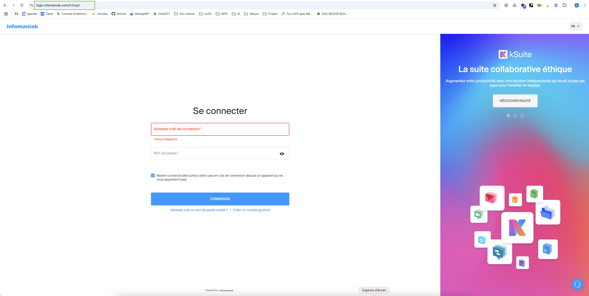
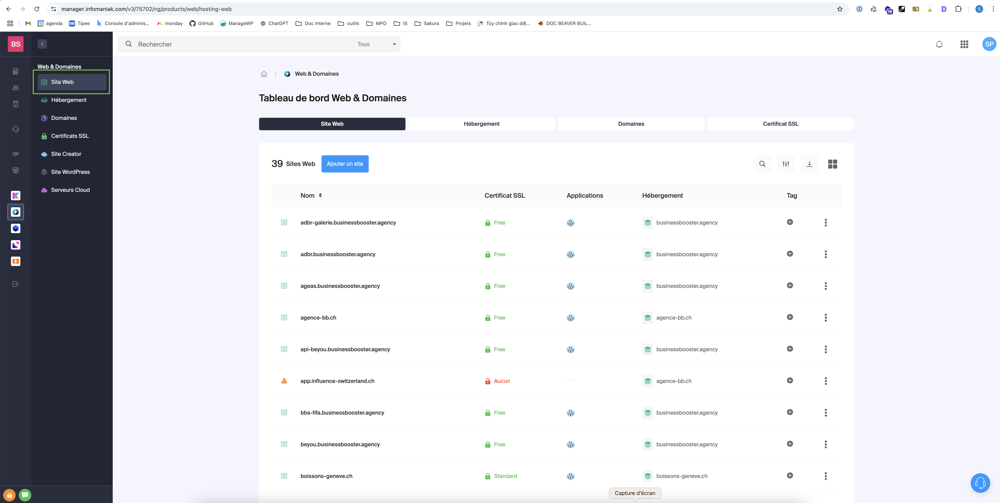
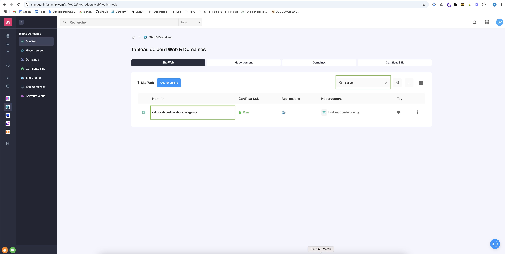
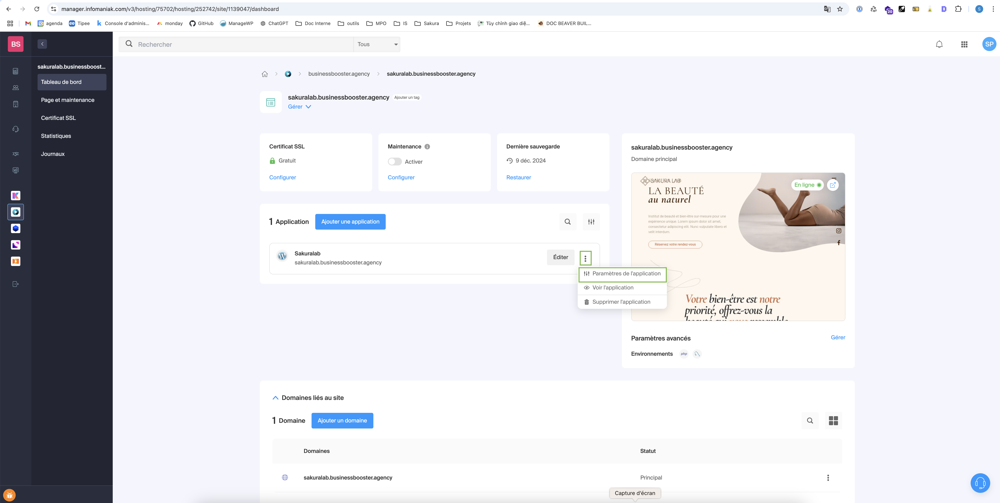
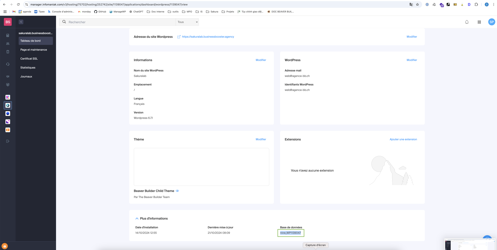
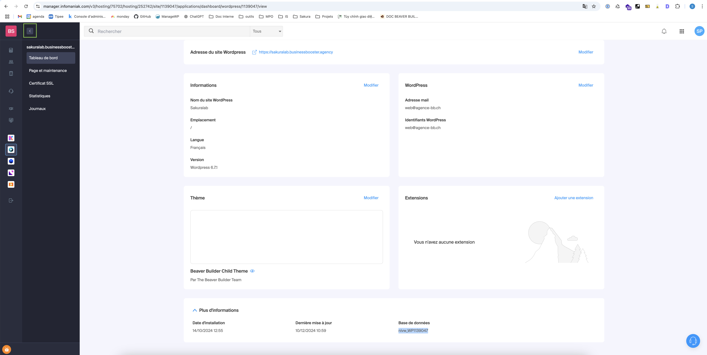
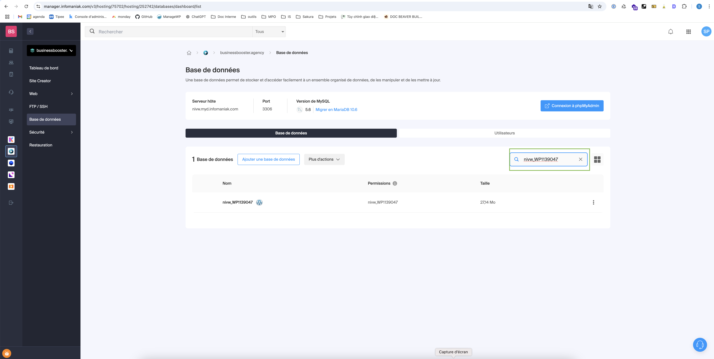
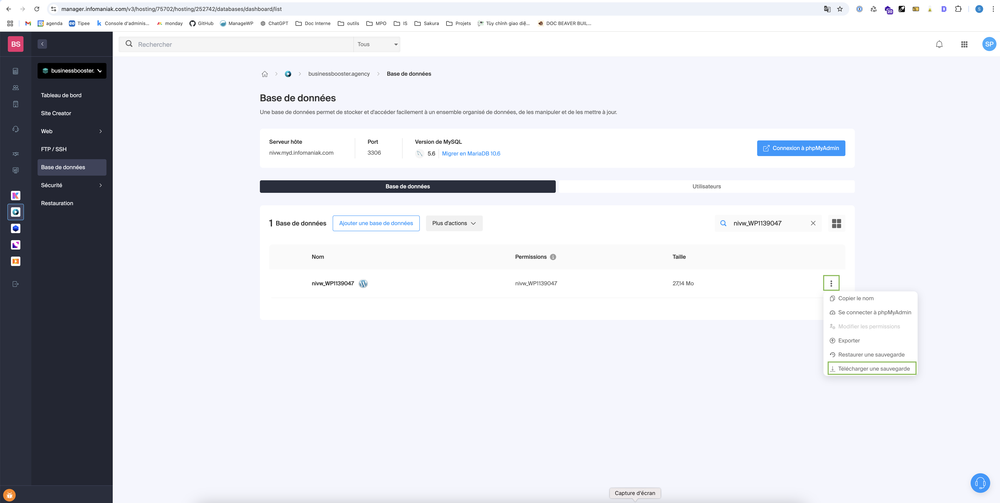
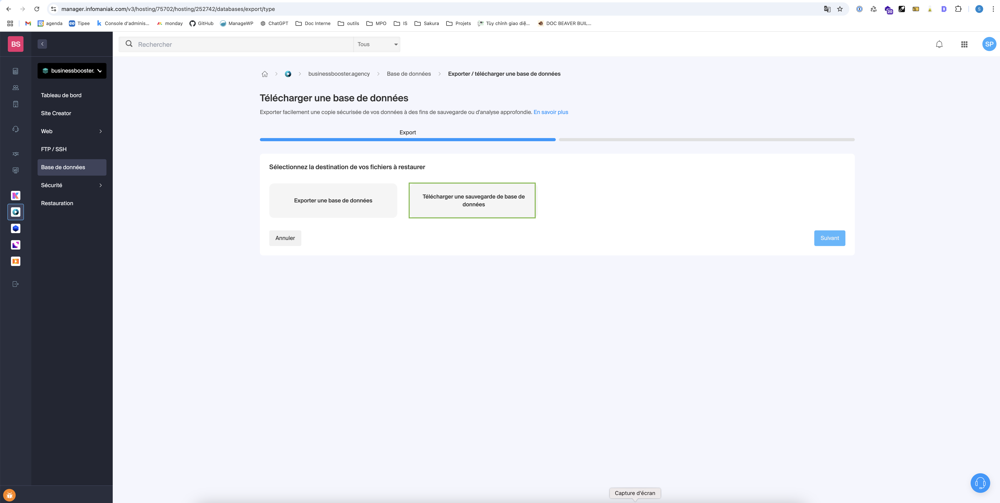

# Créer une sauvegarde

Avant de procéder à la mise en ligne de votre site, il est important de créer une sauvegarde de la base de données du site afin d'éviter toute perte d'information. Cela permet de restaurer votre site à son état actuel en cas de problème lors de la migration.

### 1. Connexion à Infomaniak 
   Rendez-vous sur [https://manager.infomaniak.com/](https://manager.infomaniak.com/) et connectez-vous à votre compte Infomaniak.  
   

### 2. Accéder au menu "Web & Domain"  
   Une fois connecté, cliquez sur **Web & Domain** dans la barre de navigation à gauche.  
   

### 3. Sélectionner **Site Web**
   Dans le menu qui apparaît, choisissez **Site Web**.  
   

### 4. Rechercher et sélectionner votre site 
   Recherchez votre site dans la liste et cliquez dessus pour accéder à sa gestion.  
   

### 5. Accéder aux paramètres de l'application 
   Dans la fenêtre qui s'ouvre, allez dans la section **Applications**. Cliquez sur les trois petits points à côté de l'application WordPress et sélectionnez **Paramètres de l'application**.  
   

### 6. Copier le nom de la base de données 
   Faites défiler la page jusqu'en bas pour trouver le nom de la base de données. Copiez-le pour l'utiliser dans l'étape suivante.  
   

### 7. Accéder à la section "Bases de données" 
   Retournez dans le menu précédent et sélectionnez **Bases de données**.  
   

### 8. Rechercher la base de données
   Dans la barre de recherche de la section **Bases de données**, collez le nom que vous avez copié précédemment.  
   

### 9. Télécharger la sauvegarde
   Cliquez sur les trois petits points à côté de la base de données et choisissez **Télécharger une sauvegarde**.  
   

### 10. Confirmer le téléchargement  
   Dans la fenêtre qui s'ouvre, cliquez sur **Télécharger une sauvegarde de la base de données** pour démarrer le téléchargement.  
   
